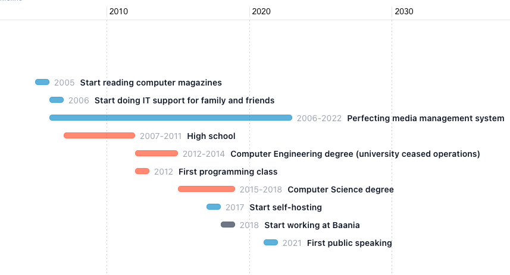

<!---  -->

I'm currently the Head of Platform Engineering at Baania. Our mission is to be the leader in Thailand's property data. The best part about this role is I get to work with [this dude](https://faithstory.info/)!

Previously I was a Data Engineer, Machine Learning Engineer and Site Reliability Engineer. Before that I was doing IT Support and System Administration.

My expertise lies in the realms of data engineering, machine learning, and devops, where I optimize processes and drive impactful projects.

Apart from my professional pursuits, I actively contribute to tech & data communities and open-source projects.

When I have lessons to share I enjoy speaking at conferences.

Surprisingly, I do enjoy cooking a lot, but not as much as tinkering with my homelab.

I’m probably listening to symphonic heavy metal.

And unsurprisingly, our tech team recognized me as DevSecMLFinDataOps.

### Timeline

### Active Communities

- [Data Engineering Discord](https://invite.gg/dataengineering) (English)
- [Data Science Discord](https://discord.com/invite/UYNaemm) (English)
- [DevOps, SRE, & Infrastructure Discord](https://discord.com/invite/VEEnHkPzY6) (English)
- [Data Engineer Cafe](https://discuss.dataengineercafe.io) (Thai)

### Misc

| Name                                                                                                                   | Badge                                                        |
| ---------------------------------------------------------------------------------------------------------------------- | ------------------------------------------------------------ |
| [HashiCorp Ambassador 2023](https://www.credly.com/badges/850db8f0-746b-4ffb-bd5e-06d84f048f1b)                        |  |
| [Google Cloud Professional Cloud Architect](https://www.credential.net/af628a29-bca4-4987-aba5-4bb1456dfe3a#gs.l9nmhc) |                    |
|[AWS Community Builder 2022](https://aws.amazon.com/developer/community/community-builders/community-builders-directory/?cb-cards.sort-by=item.additionalFields.cbName&cb-cards.sort-order=asc&awsf.builder-category=*all&awsf.location=*all&awsf.year=*all&cb-cards.q=karn%2Bwong&cb-cards.q_operator=AND)||

---

- [Recommended books]()
- [Recommended music]()
- [Talks]()
