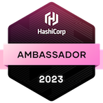
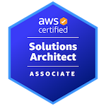
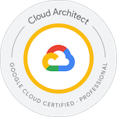

<!---  -->

I'm currently a platform engineer at [Data Cafe (Thailand)](https://www.datacafethailand.com/).

Previously I was a Data Engineer, Machine Learning Engineer and Site Reliability Engineer. Before that I was doing IT Support and System Administration.

My expertise lies in the realms of data engineering, machine learning, and devops, where I optimize processes and drive impactful projects.

Apart from my professional pursuits, I actively contribute to tech & data communities and open-source projects.

When I have lessons to share I enjoy speaking at conferences.

Surprisingly, I do enjoy cooking a lot, but not as much as tinkering with my [homelab](https://github.com/kahnwong/self-hosted).

I’m probably listening to symphonic heavy metal.

Many people wonder what I do, because I seem to hang out in a lot of communities, to which I tell them it's DevSecMLFinDataOps 😃.

Fun fact: [this dude](https://faithstory.info/) stole my homelab configuration, but I already picked his brain for management and leadership skills 🫢.

[//]: # (### Timeline)

[//]: # ()
[//]: # (![Timeline]&#40;images/2023-10-09-14-13-19.png&#41;)

### Active Communities

- [Data Engineering Discord](https://invite.gg/dataengineering) (English)
- [Data Science Discord](https://discord.com/invite/UYNaemm) (English)
- [DevOps, SRE, & Infrastructure Discord](https://discord.com/invite/VEEnHkPzY6) (English)
- [Data Engineer Cafe](https://discuss.dataengineercafe.io) (Thai)
- [Data Engineer Thailand](https://www.facebook.com/groups/dataengineerth) (Thai)

### Licenses & Certifications

| Name                                                                                                                   | Badge                                                        |
| ---------------------------------------------------------------------------------------------------------------------- | ------------------------------------------------------------ |
| [HashiCorp Ambassador 2023](https://www.credly.com/badges/850db8f0-746b-4ffb-bd5e-06d84f048f1b)                        |  |
|[AWS Certified Solutions Architect – Associate](https://www.credly.com/badges/0e07c3db-19c2-4ade-bb6c-66df4929fc5c/public_url) | |
| [Google Cloud Professional Cloud Architect](https://www.credly.com/badges/a474b598-df0d-453f-8958-3181b6392f61/public_url) |                    |
|[AWS Community Builder 2022](https://aws.amazon.com/developer/community/community-builders/community-builders-directory/?cb-cards.sort-by=item.additionalFields.cbName&cb-cards.sort-order=asc&awsf.builder-category=*all&awsf.location=*all&awsf.year=*all&cb-cards.q=karn%2Bwong&cb-cards.q_operator=AND)||

### Friends

- [Apiporn Simapornchai (Faith)](https://faithstory.info)
- [Snuufix](https://snuu.io/)
- [Chris Dong](https://cdong.us/)

---

- [Recommended books]()
- [Recommended music]()
- [Talks]()
