Updated 2023-07-05

Partial list.

## Acoustic

**City of the Sun - To The Sun And All The Cities In Between (2016)**

## Classical Crossover

**David Garrett - Rock Symphonies (2010)**

## Folk

**Percival - Slava! Pieśni Słowian Zachodnich (2018)**
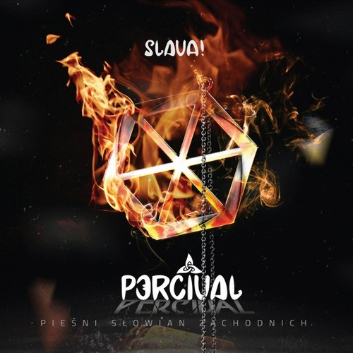

## Jazz

**Zela Margossian Quintet - Transition (2018)**
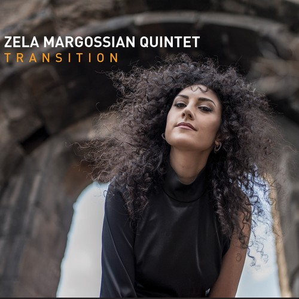

## Metal

**In Legend - Ballads 'n' Bullets (2011)**
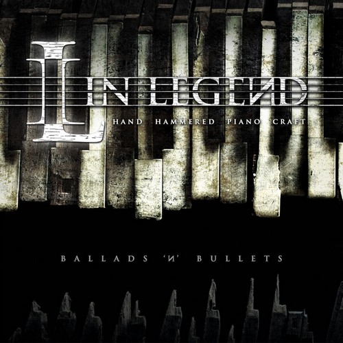

### Cello Metal

**Apocalyptica - Apocalyptica (2005)**
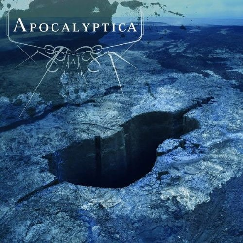

### Classical Progressive Metal

**Cydemind - Erosion (2017)**
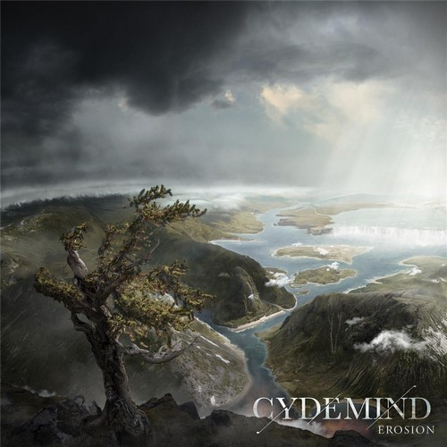

---

**Opus Arise - The Network (2022)**
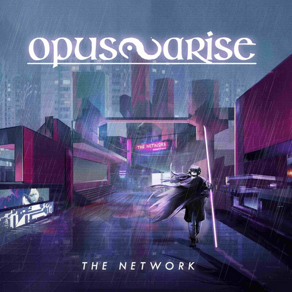

### Folk Metal

**Boisson Divine - Volentat (2016)**
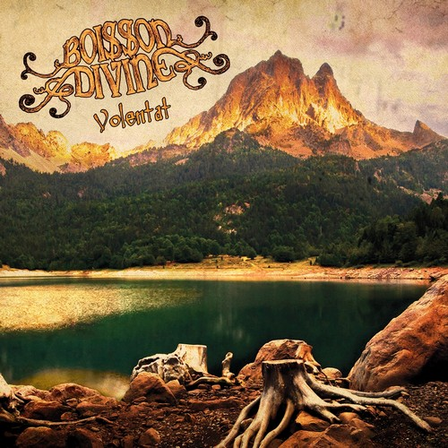

---

**Celtian - En Tierra de Hadas (2019)**
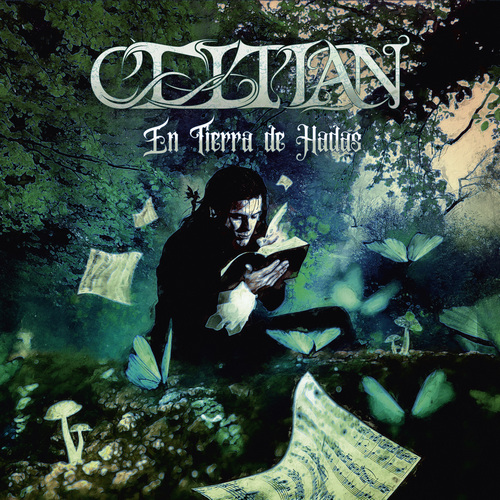

---

**Fejd - Nagelfar (2013)**
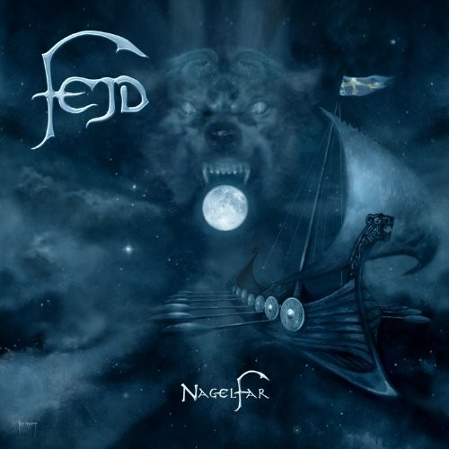

---

**Myrath - Tales of the Sands (2011)**

---

**Mysterain - Unyielding Heroine (2018)**
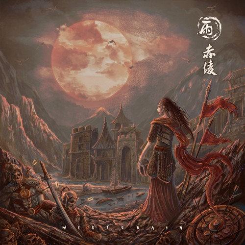

---

**Ulytau - Jumyr-Kylysh (2006)**
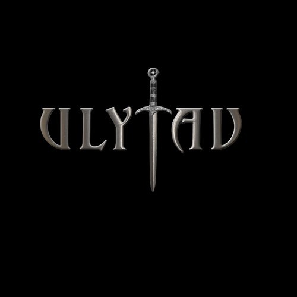

### Power Metal

**Van Canto - Tribe of Force (2010)**
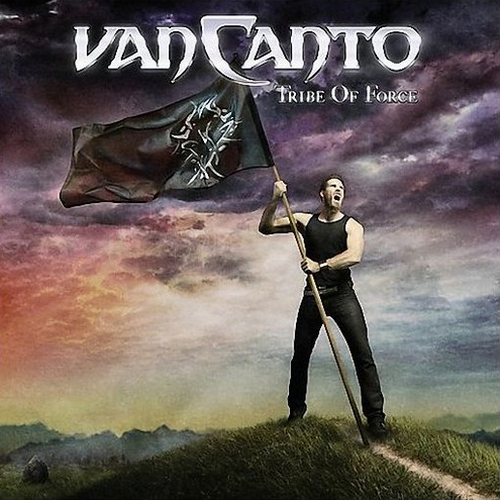

---

**Serenity - Memoria - Live (2022)**
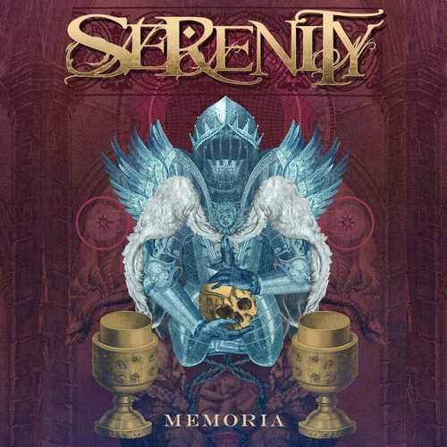

---

**Temperance - Diamanti (2021)**

---

**Visions of Atlantis - Old Routes - New Waters - EP (2016)**
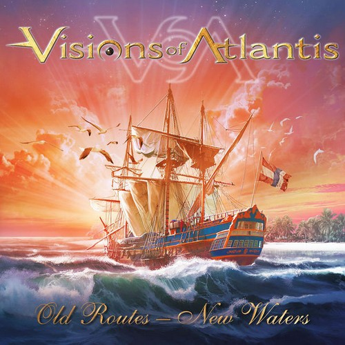

---

**Warkings - Revenge (2020)**
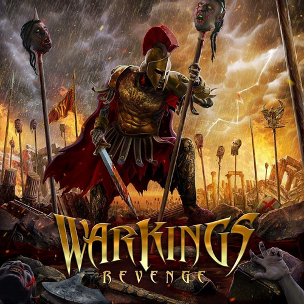

### Symphonic Metal

**Delain - Apocalypse & Chill (2020)**

---

**Epica - Epica vs Attack On Titan Songs (2017)**

## New Age

**ERA - The Live Experience (2022)**
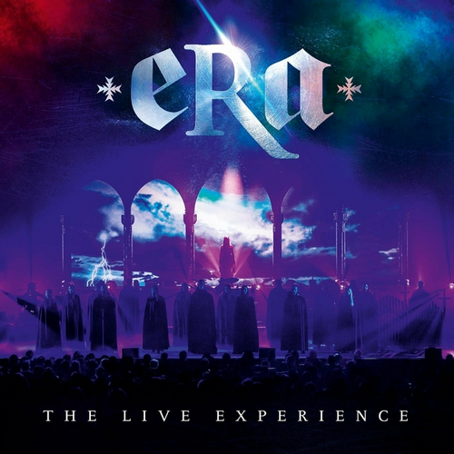

---

**Gregorian - The Dark Side of the Chant (2010)**
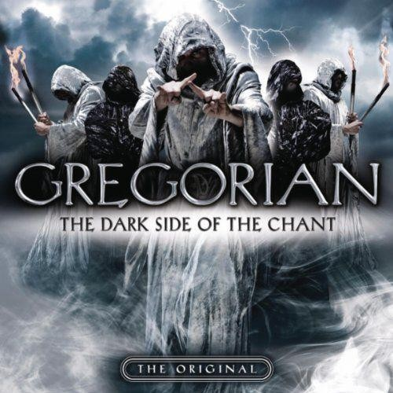

## Pop

**Amanda Somerville - Windows (2009)**
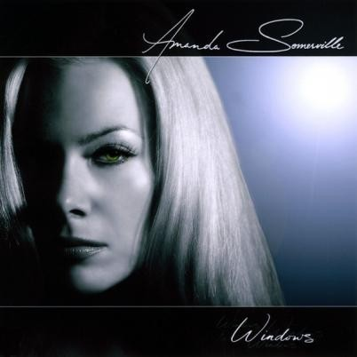

---

**Anneke van Giersbergen - Drive (2013)**
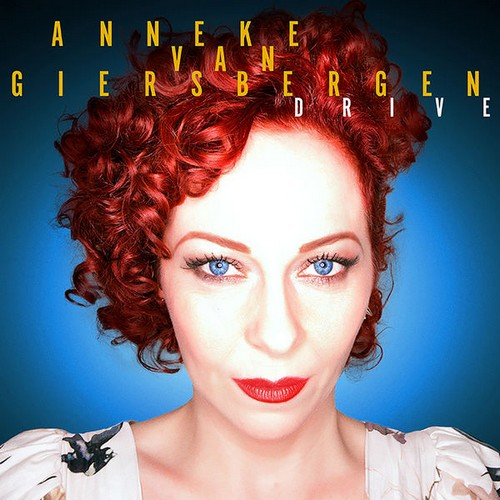

---

**Cœur de pirate - Rose (2015)**
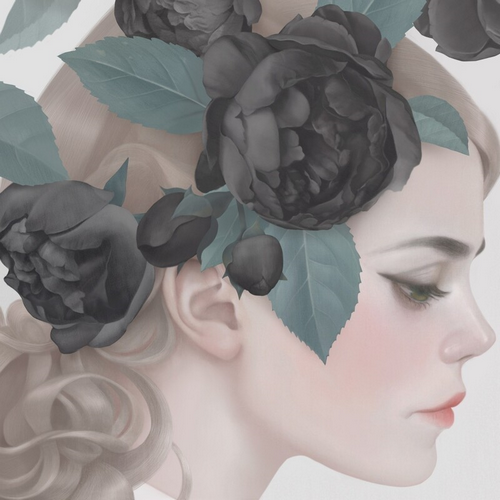

---

**Evelyne Brochu - Objets perdus (2019)**
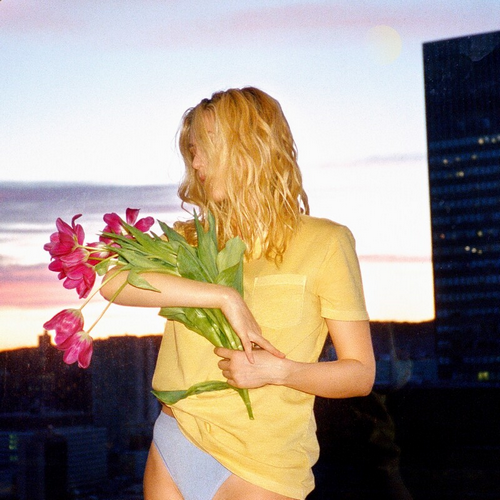

---

**Florence + the Machine - Ceremonials (2011)**

---

**Fernanda Takai - Na Medida do Impossível (2014)**
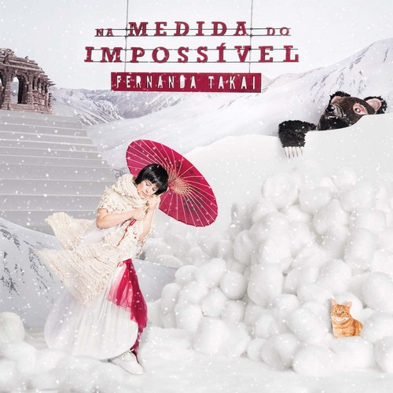

---

**Johanna Kurkela - Ingrid (2015)**
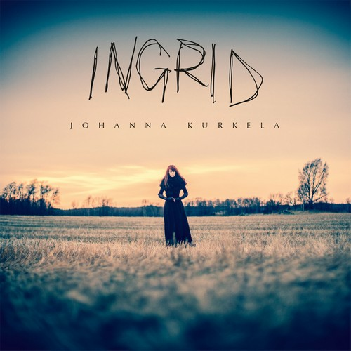

---

**Lisa Miskovsky - Umeå (2013)**

---

**Silbermond - Himmel Auf (2012)**
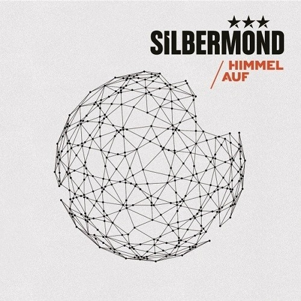

---

**The Click Five - Modern Minds and Pastimes (2007)**
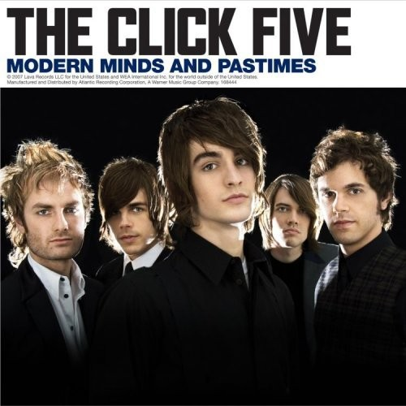

### Operatic Pop

**Laura Macrì - Terra (2017)**

## Rock

**AWS - Kint a Vízből (2016)**

---

**Hands Like Houses - Dissonants (2016)**
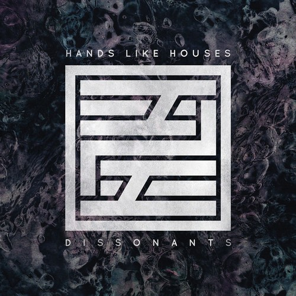

---

**Nemesea - The Quiet Resistance (2011)**

---

**Nologo - Gravity (2008)**

---

**Paramore - Brand New Eyes (2009)**
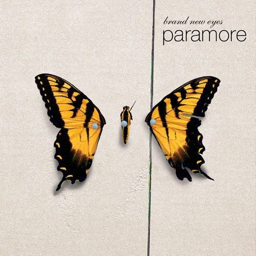

### Folk Rock

**Altan Urag - Blood (2009)**

---

**The HU - The Gereg (2020)**

---

**Wagakki Band - 八奏絵巻 (2015)**

### Symphonic Rock

**Globus - Break From This World (2011)**
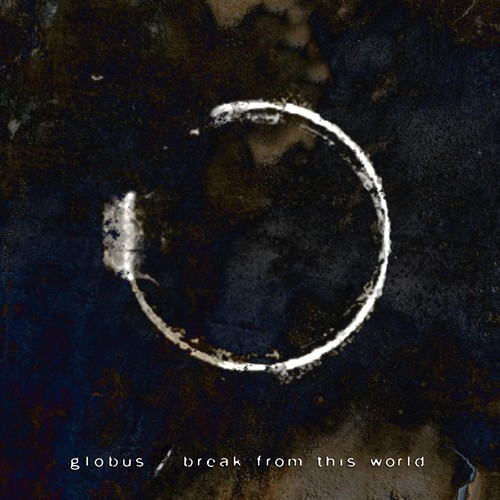

## Soundtrack

**Alexandre Desplat - Argo (2012)**

---

**Darren  Korb - Transistor (2014)**
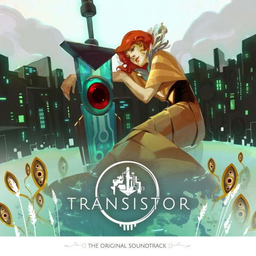

---

**Jeremy Soule - The Elder Scrolls V: Skyrim (2011)**
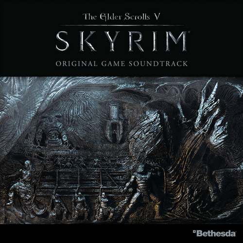

---

**Jesper Kyd - Assassin's Creed Brotherhood (2010)**

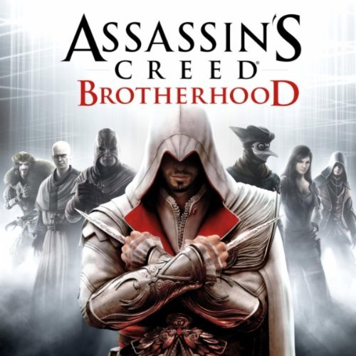

---

**Kaveh Cohen & Michael Nielsen - Tom Clancy's Splinter Cell: Conviction (2010)**

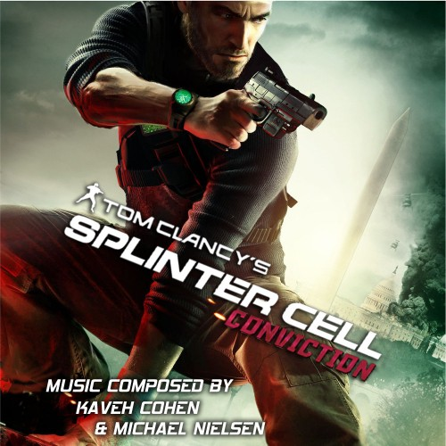

---

**Michael Giacchino - Fringe: Season 1 (2010)**
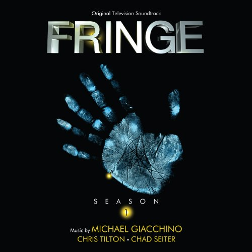

---

**Ramin Djawadi - Person of Interest (2012)**
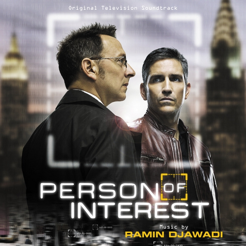
