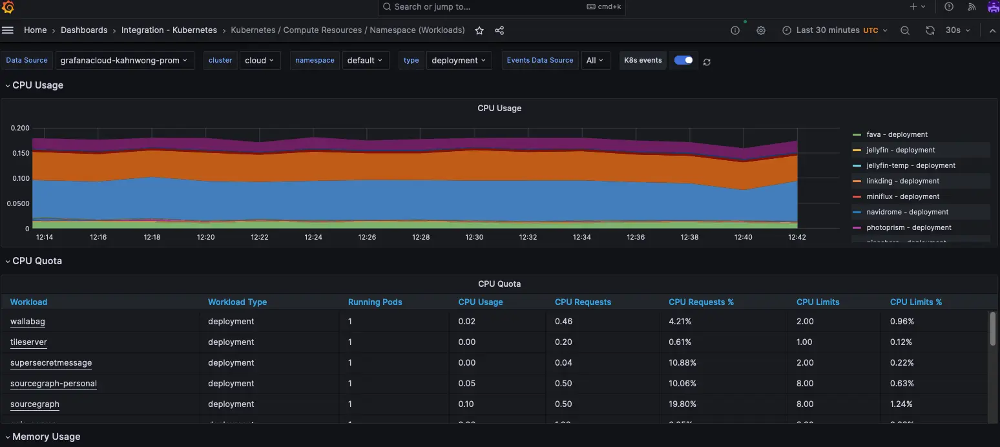

+++
title = "Kubernetes with Grafana Cloud"
date = "2023-04-01"
path = "/posts/2023/04/kubernetes-with-grafana-cloud"

[taxonomies]
categories = ["kubernetes",]
tags = [  "sre", "kubernetes", "grafana",]

+++

Kubernetes is awesome, I think this is obvious if you have more than a handful of services to manage. If you use cloud, either VM or container-based runtime, it would provide you a dashboard to see the metrics. But what about kubernetes? Since you would have multiple services inside a single cluster, in which it's backed by VMs, at best you would only see into your VMs' metrics, but doesn't provide separate metrics per each service.

In the end, what metrics dashboards are is just visualizations on collected metrics, which are stored somewhere. On open source front, usually people store metrics in prometheus, and visualize it via grafana.

To try this out, you can use [this](https://artifacthub.io/packages/helm/prometheus-community/kube-prometheus-stack) to install grafana+prometheus on your kubernetes cluster. Just port forward the grafana pod and you should be able to see the metrics.

But there's a catch: if you were to tear this down, all the collected metrics are gone. This might be ideal if you're in the development phase, where you want to make sure things are actually reproducible. But for prod this is a liability.

There is a way of out this though - use managed grafana (via [grafana cloud](https://grafana.com/)), and ship your cluster metrics to it via [grafana agent](https://grafana.com/docs/grafana-cloud/kubernetes-monitoring/configuration/config-k8s-agent-guide/).

If you follow the instructions successfully, head to your grafana cloud dashboard, and you should see your cluster metrics pop up:

And the best part is it's the same dashboards you get from installing `kube-prometheus-stack` above! And you can access the dashboard from anywhere as well, instead of doing a port forward every time you want to see the dashboard.
