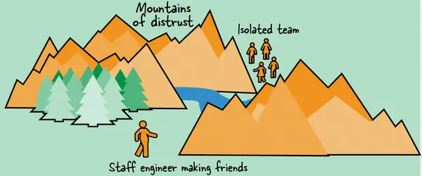
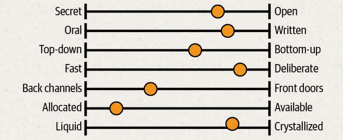
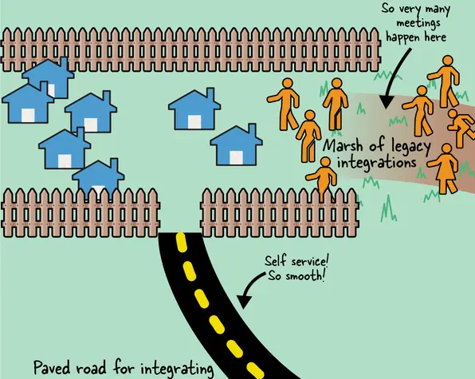
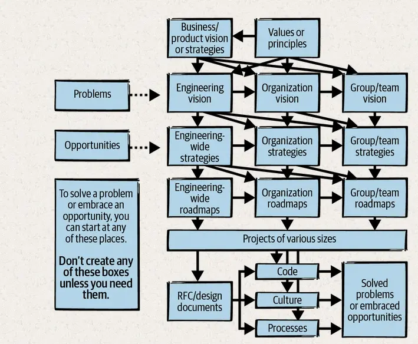
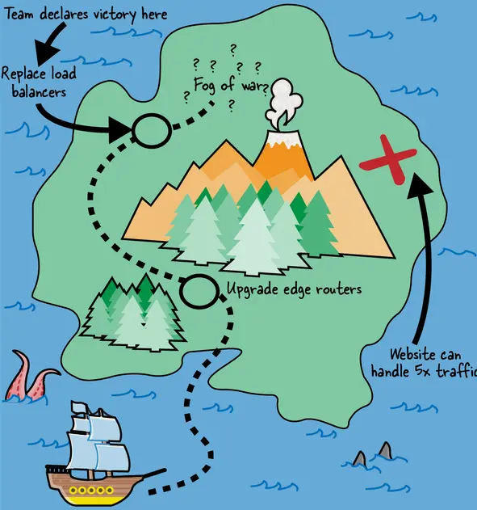

## Opportunity cost

Staff engineers’ skills are usually in high demand. If you’re assigned to a single team, you may not be top of mind for solving a problem elsewhere in the org, or your manager may be unwilling to let you go.

## Losing empathy

It’s easy to overfocus and forget that the rest of the world exists, or start thinking of other technology areas as trivial compared to your rich, nuanced domain.

## Escaping the echo chamber

When you find yourself in an echo chamber where everyone you meet holds the same set of opinions, it can be a shock when you connect with peers in other groups and discover that some of their views are just…different.

## A staff engineer navigating tricky terrain

## Secret or open?

How much does everyone know? In secret organizations, information is currency and nobody gives it away easily. Everyone’s calendars are private. Slack channels are invite-only. Often you can get access to something if you ask for it, but you have to know it exists! When all information is need-to-know, it’s harder to come up with creative solutions or really understand why something’s not working.

In open organizations, you’ll have access to everything (even messy first drafts!). You might get decision fatigue from choosing which information to consume. You might not know which documents are official and need action, and which are just early ideas. And open information can lead to more drama: it’s harder for bad ideas to be quietly shut down.

Knowing the cultural expectations around sharing is crucial. In a culture that keeps knowledge locked down, you’ll lose your boss’s trust if you reshare something they told you in confidence. In a more open company, you’ll be considered political or untrustworthy if you withhold information or don’t make sure everyone knows what’s going on.

## Most companies will be somewhere in the middle on each of these attributes

## Pathological

A low-cooperation culture where power and status are the goal and people hoard information; in Westrum’s words, “a preoccupation with personal power, needs, and glory”

## The chasm between an infrastructure and a product engineering organization

## Disputed territory

It’s very hard to draw team boundaries in a way that lets each team work autonomously. No matter how opinionated your APIs, contracts, or team charters, there will inevitably be some pieces of work that multiple teams think they own, and navigating those disputes can feel risky.

## The new paved road is beautiful, but most of the places people actually want to go are deep in the marsh

## Asking to join in

Once you discover a meeting where important decisions get made, it’s natural to want to be part of it. But you’ll need a compelling story for why that should happen. It seems obvious, but your reasons should be about impact to your organization, not to you personally. No matter how much your peer managers like you, framing your exclusion as being bad for your career advancement will be unlikely to change hearts and minds. Show how including you will make your organization better at achieving its goals. Show what you can bring that’s not already there. Have a clear narrative about why you need access, practice your talking points, and go ask to join.

You will probably get some resistance. Adding someone to a group is rarely free for the people who are already there. Every extra person in any meeting slows it down, extends discussions, and reduces attendees’ willingness to be vulnerable or brutally honest. If the group is used to working together, every new person resets the dynamic; to some extent, attendees have to learn to work together again.

## Shadow org chart

Shadow org chart: the unwritten structures through which power and influence flow. The shadow org chart helps you understand who the influencers of the group are, and it’s probably not the same as the actual org chart. These influencers are the people you need to convince before a change can happen.

## Engineers stop growing

Focusing only on short-term goals limits the way you think about and frame your work, and how much ownership you take of the work that falls into the cracks between tasks. If the team is trying to achieve a big project, they’ll have to identify the gaps between the assigned tasks and figure out how to fill them, building skills in the process. A team that’s used to iterating on short, clearly specified goals won’t build muscle for bigger, more difficult projects and won’t be able to tell the story of why they did what they did.

## The story of where you were and how much progress you’ve made as well as where you’re going

## Tragedy of the commons

Teams pursuing their own best action without coordinating with others leads to an outcome that is bad for everyone. There’s that local maximum again.

## Depending on the size of the problem, you might start with an engineering-wide vision, a team-scoped vision, or something in between. Don’t create a vision, strategy, etc., unless you need it

## Embrace the Boring Ideas

I kind of think writing about engineering strategy is hard because good strategy is pretty boring, and it’s kind of boring to write about. Also I think when people hear “strategy” they think “innovation.” If you write something interesting, it’s probably wrong. This seems directionally correct, certainly most strategy is synthesis and that point isn’t often made!

## Step away

Tech companies’ promotion systems can incentivize engineers to feel like they need to “win” a technical direction or be the face of a project. This competition can lead to “ape games”: dominance plays and politicking, where each person tries to establish themselves as the leader in the space, considering other people’s ideas to be threatening. It’s toxic to collaboration and makes success much harder to achieve.

## Robert Konigsberg

“Don’t forget that just because something came from your brain doesn’t make it the best idea.”

## Set Scope

Be practical about what’s possible. If your vision of the future involves something entirely out of your control, like a change of CEO or an adjustment in your customers’ buying patterns, you’ve crossed into magical thinking. Work around your fixed constraints, rather than ignoring them or wishing they were different.

## Nemawashi

If you keep your stakeholders aligned as you go along, your document won’t ever have a point where you’re sharing a finished document with a group of people who are learning about it for the first time. When I spoke with Zach Millman, pillar tech lead at Asana, about creating a strategy there, he told me that he used the process of nemawashi, one of the pillars of the Toyota Production System. It means sharing information and laying the foundations so that by the time a decision is made, there’s already a consensus of opinion.

## Recruiting people

Try to avoid relying on one person’s very specific skill set. People move between companies often, and you don’t want a single point of failure.

## Blocked by a Single `$%@$%` Button Click

Why did we insist on a week’s notice? Because these configurations weren’t our only work. Hundreds of teams used our banks of balancers, and load balancing was just one of the four critical services my team supported. We didn’t want to react constantly: we wanted to plan out our weeks, and to make these configuration changes in batches rather than continually restarting services every time. As a result, we had little sympathy for people who came in hot and angry about why we hadn’t done the thing they’d told us about only a few hours ago. Our team motto became “lack of planning on your part is not an emergency on mine.”

## What Are You Asking For?

I love the “Three Bullets and a Call to Action” method that Brian Fitzpatrick and Ben Collins-Sussman outline in their book, Debugging Teams (O’Reilly). As they write: “A good Three Bullets and a Call to Action email contains (at most) three bullet points detailing the issue at hand, and one—and only one—call to action. That’s it, nothing more—you need to write an email that can be easily forwarded along. If you ramble or put four completely different things in the email, you can be certain that they’ll pick only one thing to respond to, and it will be the item that you care least about. Or worse, the mental overhead is high enough that your mail will get dropped entirely.”

## The team declared victory and went home—but there was another, better treasure they never got to

## It’s Built on a Shaky Foundation

I used to work in a data center, a long time ago, and one thing I learned there is that there’s no such thing as a temporary solution. If someone ran a cable from one rack to another without neatly cabling and labeling it, it would stay there until the server was decommissioned. The same is true for every temporary hack: if you don’t have it in good shape by the end of the project, it’s going to take extraordinary effort to clean it up later.

## Know Things

No matter how good your leadership, you can’t be a technical leader without the “technical” part. Your big-picture thinking, project execution, credibility, and influence are underpinned by knowledge and experience. A big part of the value proposition of hiring you is your knowledge: you have seen some things.

## Build experience

It may feel like a compliment when someone offers you the job of manager—hell, take the compliment —but they are not doing you any favors when it comes to your career or your ability to be effective.

## Admit what you don’t know

Admitting ignorance is one of the most important things we can do as tech leads, senior engineers, mentors, managers, and other influencers of team culture.

## Understand your own context

A huge part of self-awareness is understanding that you have a perspective, that your context is not the universal context, and that your opinions and knowledge are specific to you. You’ll need to escape your echo chamber every time you talk to teams in other areas or explain technical topics to nonengineers. You’ll know what information you have that they might not, so you can bridge that gap.

## Don’t delegate through neglect

If glue work is needed for your organization or your project, recognize it and understand who is doing it. Be aware that managers, promotion committees, and future employers might consider this work to be leadership when a staff engineer does it, but dismiss it when a more junior engineer does. So take ownership and do a lot of the work that’s not anybody’s job but that furthers your goals. Redirect your junior colleagues toward tasks that will develop their careers instead.

## Remember There’s a Team

The final thought in focusing on the mission: remember you’re not doing this work alone. While you may be the best coder on the team, the most experienced engineer, or the fastest problem solver, that doesn’t mean you should jump on all of the problems. You’re working as part of a team, not a collection of competing individuals. Don’t become a single point of failure where the team can’t get anything done when you’re not available. It’s not sustainable. It hides problems.

## Create Future Leaders

The degree to which other people want to work with you is a direct indication of how successful you’ll be in your career as an engineer. Be the engineer that everyone wants to work with.

## Peer reviews

It’s a common joke in tech women circles that you know you’re acting at senior level when you get your first peer review saying you’re “abrasive.”

## Process Preamble

If you write down every edge case, you end up with a three-ring binder of policy and legalese, and it probably still won’t cover every situation. And everyone still hates it!

## Lara Hogan

Your colleagues won’t learn as much if you only delegate the work after you’ve turned it into “beautifully packaged, cleanly wrapped gifts.” If you instead give them “a messy, unscoped project with a bit of a safety net,” they’ll get a chance to hone their problem-solving abilities, build their own support system, and stretch their skill set. A messy project is a learning opportunity that’s hard to get otherwise.

## Delegation

This pattern is common in recruiting mails: “Come do exactly the thing you’re currently doing, but at another company.” There are times when that will work, but the most successful recruitment I’ve seen is for roles that offer people a step up, something slightly scary.

## Change Teams

Moving between teams or organizations can be an excellent way of building bridges: you’ll still have contacts on your own team, and you’ll bring knowledge and culture with you to the new one. You’ll also bring perspective: you already have an outside view of the team and how they’re perceived by the rest of the organization.

## Take a Management Role

The best frontline eng managers in the world are the ones that are never more than 2-3 years removed from hands-on work, full time down in the trenches. The best individual contributors are the ones who have done time in management. And the best technical leaders in the world are often the ones who do both. Back and forth. Like a pendulum.

## Charity Majors

“If you’re a manager, your job is to get better at management. Don’t try to cling to your former glory.”

## Prepare to Reset

Not all newly hired senior leaders are entirely committed to or feel comfortable turning themselves into the leader the organization truly needs, rather than the leader they’ve grown to be over the past years. Many leaders take the opposite approach of trying to mold the organization in their image or the image of the past workplace. Engineering leaders brought into embattled organizations tasked with stabilizing the chaos are often heavily incentivized to do this. Many a time these folks, in my experience, tend to fail harder and more often than those who try to learn the organizational ropes and tailor their leadership style to fit the organizational culture.
