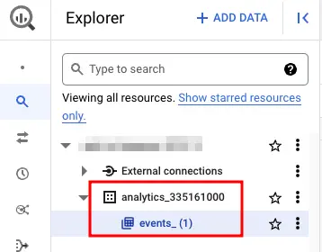

## Background

You want to track who access your site, Google Analytics can do that. To see the data, you can use Google Analytics dashboard, the default settings is good enough for most use cases. But what if you have a lot of tracking data, and you want to streamline a way to analyze it? You could use Data Studio for this, so it's cool for the moment. But what if you want to use Google Analytics data in conjunction with other data? Say, product SKUs? There are multiple ways to achieve that, but one approach that provides a lot of flexibility and allow for long-term maintenance is to write a custom pipeline yourself.

So we're back to grabbing the tracking data and store it somewhere. Google Analytics provide APIs that you can call to obtain the data. This works, with a few caveats... One being that if you have a lot of data, you would run into API rate-limiting 🥲.

But you probably are not the only one who amassed a lot of tracking data, and luckily there's a solution to this problem: dunk Google Analytics data into BigQuery, then you can use Spark to ingest it ✨. (You can set it to "streaming" mode as well, if you want near real-time data.)

## [Setup](https://support.google.com/analytics/answer/9823238?hl=en&ref_topic=9359001#zippy=%2Cin-this-article)

1. Create a new project in GCP console.
2. Enable `BigQuery API`.
3. Go to [Google Analytics console](https://analytics.google.com/) > admin > product links > BigQuery links.
4. Click `Link` > select your BigQuery project where you want to store Google Analytics data.
5. Fill in information as required.
6. Wait for a day. (Initial setup only.)
7. Head back to [BigQuery console](https://console.cloud.google.com/bigquery) and you should see the results.



## Ingestion

You can use any tools you want to read data off BigQuery. Personally I would go with `Spark`, because you can do fine-grained ingestion control that way, and it plays nicely with `s3a` or `gs` protocol for write destination.

```python
spark = (
    SparkSession.builder.config("spark.executor.memory", "4g")
    .config("spark.driver.memory", "4g")
    .config(
        "spark.jars.packages",
        "com.google.cloud.spark:spark-bigquery-with-dependencies_2.12:0.29.0",
    )
    .getOrCreate()
)

df = (
    spark.read.format("bigquery")
    .option("table", "ga4-to-bigquery-xxxxxx.analytics_xxxxxxxxx.events_20230318")
    .load()
)
```

Now you'll get data that looks like this:

```
-RECORD 0---------------------------------------------
 event_date                    | 20230318
 event_timestamp               | 1679110653461084
 event_name                    | session_start
 event_params                  | [{engaged_session...
 event_previous_timestamp      | null
 event_value_in_usd            | null
 event_bundle_sequence_id      | 1779024476
 event_server_timestamp_offset | null
 user_id                       | null
 user_pseudo_id                | 653547550.1673451049
 privacy_info                  | {null, null, No}
 user_properties               | []
 user_first_touch_timestamp    | 1673451049581992
 user_ltv                      | {0.0, USD}
 device                        | {mobile, Samsung,...
 geo                           | {Asia, Thailand, ...
 app_info                      | null
 traffic_source                | {(referral), refe...
 stream_id                     | 4111827120
 platform                      | WEB
 event_dimensions              | null
 ecommerce                     | null
 items                         | []
-RECORD 1---------------------------------------------
 event_date                    | 20230318
 event_timestamp               | 1679110653461084
 event_name                    | page_view
 event_params                  | [{medium, {referr...
 event_previous_timestamp      | null
 event_value_in_usd            | null
 event_bundle_sequence_id      | 1779024476
 event_server_timestamp_offset | null
 user_id                       | null
 user_pseudo_id                | 653547550.1673451049
 privacy_info                  | {null, null, No}
 user_properties               | []
 user_first_touch_timestamp    | 1673451049581992
 user_ltv                      | {0.0, USD}
 device                        | {mobile, Samsung,...
 geo                           | {Asia, Thailand, ...
 app_info                      | null
 traffic_source                | {(referral), refe...
 stream_id                     | 4111827120
 platform                      | WEB
 event_dimensions              | null
 ecommerce                     | null
 items                         | []
-RECORD 2---------------------------------------------
 event_date                    | 20230318
 event_timestamp               | 1679110659760543
 event_name                    | scroll
 event_params                  | [{campaign, {(ref...
 event_previous_timestamp      | null
 event_value_in_usd            | null
 event_bundle_sequence_id      | 1785323935
 event_server_timestamp_offset | null
 user_id                       | null
 user_pseudo_id                | 653547550.1673451049
 privacy_info                  | {null, null, No}
 user_properties               | []
 user_first_touch_timestamp    | 1673451049581992
 user_ltv                      | {0.0, USD}
 device                        | {mobile, Samsung,...
 geo                           | {Asia, Thailand, ...
 app_info                      | null
 traffic_source                | {(referral), refe...
 stream_id                     | 4111827120
 platform                      | WEB
 event_dimensions              | null
 ecommerce                     | null
 items                         | []
```

And nice thing about spark is that it supports nested schema!

```
root
 |-- event_date: string (nullable = true)
 |-- event_timestamp: long (nullable = true)
 |-- event_name: string (nullable = true)
 |-- event_params: array (nullable = true)
 |    |-- element: struct (containsNull = true)
 |    |    |-- key: string (nullable = true)
 |    |    |-- value: struct (nullable = true)
 |    |    |    |-- string_value: string (nullable = true)
 |    |    |    |-- int_value: long (nullable = true)
 |    |    |    |-- float_value: double (nullable = true)
 |    |    |    |-- double_value: double (nullable = true)
 |-- event_previous_timestamp: long (nullable = true)
 |-- event_value_in_usd: double (nullable = true)
 |-- event_bundle_sequence_id: long (nullable = true)
 |-- event_server_timestamp_offset: long (nullable = true)
 |-- user_id: string (nullable = true)
 |-- user_pseudo_id: string (nullable = true)
 |-- privacy_info: struct (nullable = true)
 |    |-- analytics_storage: string (nullable = true)
 |    |-- ads_storage: string (nullable = true)
 |    |-- uses_transient_token: string (nullable = true)
 |-- user_properties: array (nullable = true)
 |    |-- element: struct (containsNull = true)
 |    |    |-- key: string (nullable = true)
 |    |    |-- value: struct (nullable = true)
 |    |    |    |-- string_value: string (nullable = true)
 |    |    |    |-- int_value: long (nullable = true)
 |    |    |    |-- float_value: double (nullable = true)
 |    |    |    |-- double_value: double (nullable = true)
 |    |    |    |-- set_timestamp_micros: long (nullable = true)
 |-- user_first_touch_timestamp: long (nullable = true)
 |-- user_ltv: struct (nullable = true)
 |    |-- revenue: double (nullable = true)
 |    |-- currency: string (nullable = true)
 |-- device: struct (nullable = true)
 |    |-- category: string (nullable = true)
 |    |-- mobile_brand_name: string (nullable = true)
 |    |-- mobile_model_name: string (nullable = true)
 |    |-- mobile_marketing_name: string (nullable = true)
 |    |-- mobile_os_hardware_model: string (nullable = true)
 |    |-- operating_system: string (nullable = true)
 |    |-- operating_system_version: string (nullable = true)
 |    |-- vendor_id: string (nullable = true)
 |    |-- advertising_id: string (nullable = true)
 |    |-- language: string (nullable = true)
 |    |-- is_limited_ad_tracking: string (nullable = true)
 |    |-- time_zone_offset_seconds: long (nullable = true)
 |    |-- browser: string (nullable = true)
 |    |-- browser_version: string (nullable = true)
 |    |-- web_info: struct (nullable = true)
 |    |    |-- browser: string (nullable = true)
 |    |    |-- browser_version: string (nullable = true)
 |    |    |-- hostname: string (nullable = true)
 |-- geo: struct (nullable = true)
 |    |-- continent: string (nullable = true)
 |    |-- country: string (nullable = true)
 |    |-- region: string (nullable = true)
 |    |-- city: string (nullable = true)
 |    |-- sub_continent: string (nullable = true)
 |    |-- metro: string (nullable = true)
 |-- app_info: struct (nullable = true)
 |    |-- id: string (nullable = true)
 |    |-- version: string (nullable = true)
 |    |-- install_store: string (nullable = true)
 |    |-- firebase_app_id: string (nullable = true)
 |    |-- install_source: string (nullable = true)
 |-- traffic_source: struct (nullable = true)
 |    |-- name: string (nullable = true)
 |    |-- medium: string (nullable = true)
 |    |-- source: string (nullable = true)
 |-- stream_id: string (nullable = true)
 |-- platform: string (nullable = true)
 |-- event_dimensions: struct (nullable = true)
 |    |-- hostname: string (nullable = true)
 |-- ecommerce: struct (nullable = true)
 |    |-- total_item_quantity: long (nullable = true)
 |    |-- purchase_revenue_in_usd: double (nullable = true)
 |    |-- purchase_revenue: double (nullable = true)
 |    |-- refund_value_in_usd: double (nullable = true)
 |    |-- refund_value: double (nullable = true)
 |    |-- shipping_value_in_usd: double (nullable = true)
 |    |-- shipping_value: double (nullable = true)
 |    |-- tax_value_in_usd: double (nullable = true)
 |    |-- tax_value: double (nullable = true)
 |    |-- unique_items: long (nullable = true)
 |    |-- transaction_id: string (nullable = true)
 |-- items: array (nullable = true)
 |    |-- element: struct (containsNull = true)
 |    |    |-- item_id: string (nullable = true)
 |    |    |-- item_name: string (nullable = true)
 |    |    |-- item_brand: string (nullable = true)
 |    |    |-- item_variant: string (nullable = true)
 |    |    |-- item_category: string (nullable = true)
 |    |    |-- item_category2: string (nullable = true)
 |    |    |-- item_category3: string (nullable = true)
 |    |    |-- item_category4: string (nullable = true)
 |    |    |-- item_category5: string (nullable = true)
 |    |    |-- price_in_usd: double (nullable = true)
 |    |    |-- price: double (nullable = true)
 |    |    |-- quantity: long (nullable = true)
 |    |    |-- item_revenue_in_usd: double (nullable = true)
 |    |    |-- item_revenue: double (nullable = true)
 |    |    |-- item_refund_in_usd: double (nullable = true)
 |    |    |-- item_refund: double (nullable = true)
 |    |    |-- coupon: string (nullable = true)
 |    |    |-- affiliation: string (nullable = true)
 |    |    |-- location_id: string (nullable = true)
 |    |    |-- item_list_id: string (nullable = true)
 |    |    |-- item_list_name: string (nullable = true)
 |    |    |-- item_list_index: string (nullable = true)
 |    |    |-- promotion_id: string (nullable = true)
 |    |    |-- promotion_name: string (nullable = true)
 |    |    |-- creative_name: string (nullable = true)
 |    |    |-- creative_slot: string (nullable = true)
```

Neato!
