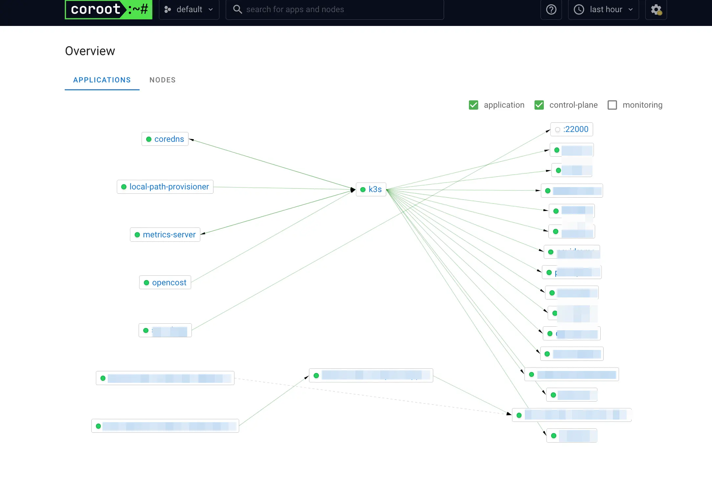
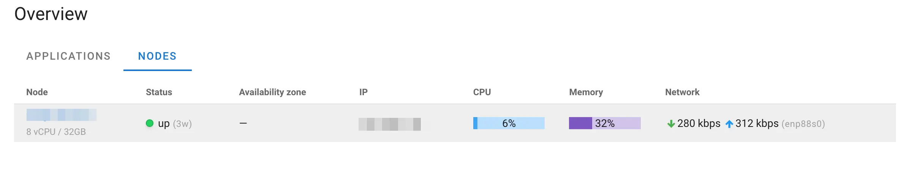
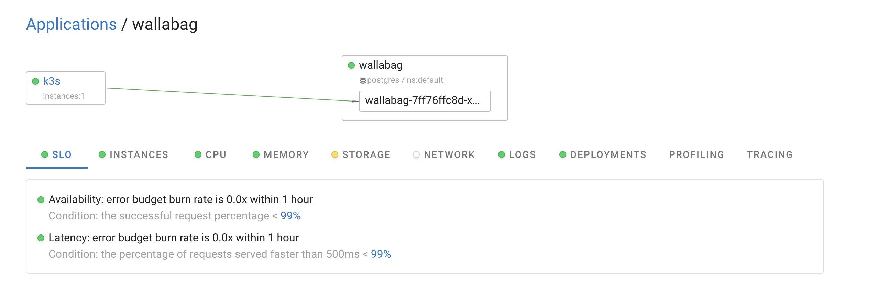
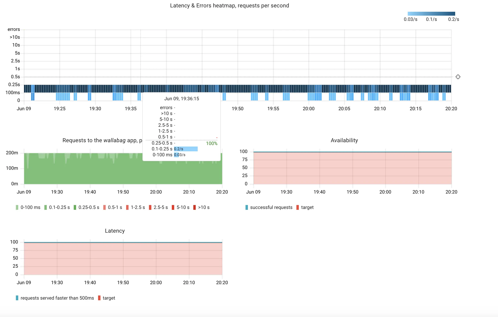
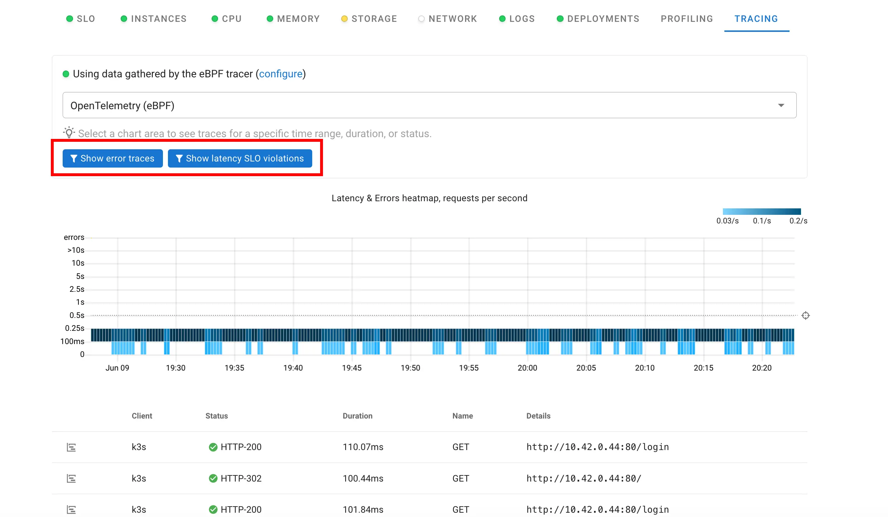

Successfully deploying services are not the end, maintenance is coming to town! When you want to see how your system works, usually people rely on SaaS like Datadog or New Relic to do the heavy lifting. Also a lot of $$$ is required.

Also with SaaS like these, usually you have to config your application to forward metrics/logs to your monitoring provider, this could mean a few months of engineering man-days.

In contrast, what if you can install a single service that lives locally on your Kubernetes cluster, and it can provide almost everything Datadog can offer, without having to configure your applications to access the metrics/logs? Spoiler: everyone is happy and you save a lot more money!

Utilizing eBPF, Coroot can access telemetry data at the Linux Kernel level.

Installation is as easy as:

```bash
helm repo add coroot https://coroot.github.io/helm-charts
helm repo update

helm install --namespace coroot --create-namespace coroot coroot/coroot
```

And access via <http://localhost:8080>

```bash
kubectl port-forward -n coroot service/coroot 8080:8080
```

---

Most of my services are on Kubernetes installed via `k3s`.


---

Since I am installing Coroot on my home server, only a single node is reported, and it's mostly stay idle because I'm the only user.


---

When you access each service, it would display overview status for each observability metrics.


---

Hello four golden signals!


---

Under `tracing`, you can see which routes are being requested and you can see that Coroot is tailor-made for SRE disciplines because they also provide a quick-access button to see `error traces` and `latency SLO violations`.


---

You can tinker much more with Coroot, so head over to their [official website](https://coroot.com/) and let me know how it works with your setup!
