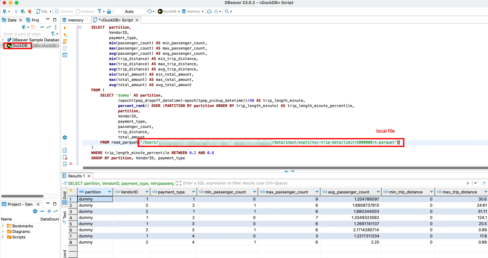
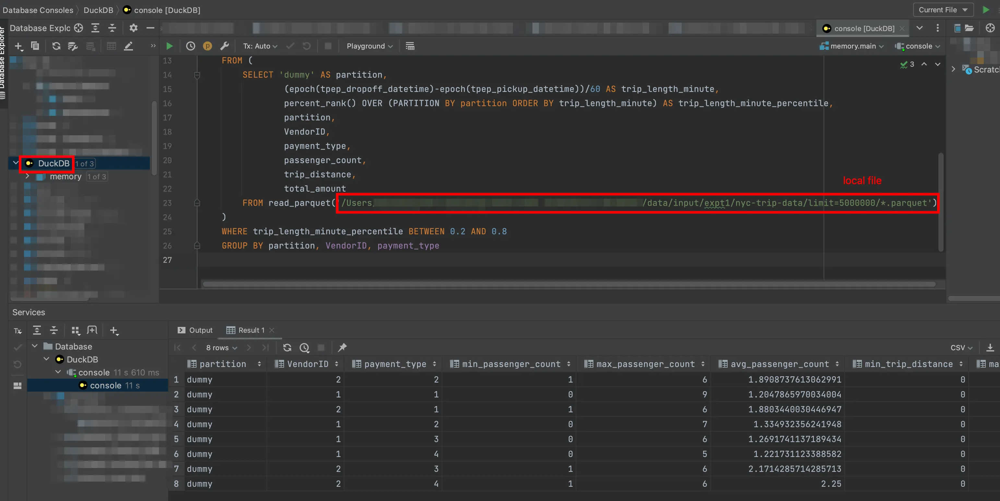

CSV as a file format is very versatile, almost any programs can parse it. The only issue is you can't use SQL against CSV files directly.

This is a major pain point, since using SQL is so much faster than firing up a jupyter notebook and wrangle the data in python, or use Excel and apply transformations until you get desired results.

But the question is how do we use SQL against CSV files in the first place. Many people want this to become a reality, so a few tools exist on github:

- [csvq](https://github.com/mithrandie/csvq)
- [q](https://github.com/harelba/q)
- [trdsql](https://github.com/noborus/trdsql)

Only issue is these tools require you to use CLI interface. Your analysts would be screaming at the top of their lungs because they are afraid of a black box with a blinking cursor 😱.

But you can also standing up a postgres database, and import data as a table and use SQL against it, but guess how many analysts want to learn how to spin up a database and config a database client to connect to a database instance?

Interestingly enough, you can use in-memory [DuckDB](https://duckdb.org/) against local files, and the best part about this is you can use GUI-based database IDE! I only tested against [DBeaver](https://dbeaver.io/) and [DataGrip](https://www.jetbrains.com/datagrip/), but any tools that use `JDBC` driver to talk to DuckDB should also works.

As for `JDBC URI`, set it as `jdbc:duckdb::memory:`

DBeaver:

DataGrip:

The whole process takes less than 5 minutes. Give it a try and let me know how it goes!
