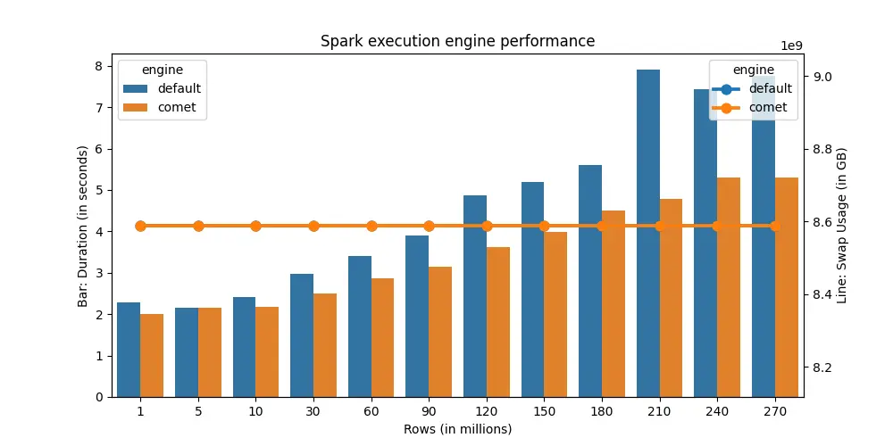
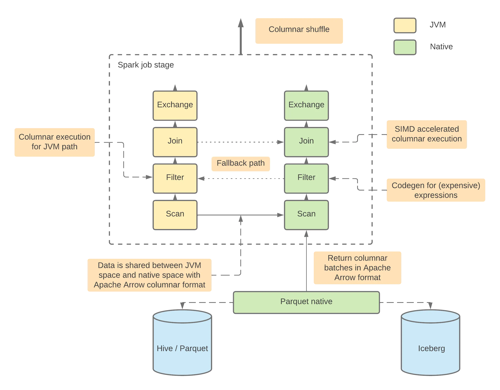

+++
title = "Faster spark workloads with Comet"
date = "2024-04-07"
path = "/posts/2024/04/faster-spark-workloads-with-comet"

[taxonomies]
categories = [  "data-engineering",]
tags = [ "spark","benchmark",]

+++

For big data processing, spark is still king. Over the years, many improvements have been made to improve spark performance. Databricks themselves created [photon](https://www.databricks.com/product/photon), a spark engine that can accelerate spark queries, but this is proprietary to Databricks.

Other alternatives do exist (see [here](https://arrow.apache.org/blog/2024/03/06/comet-donation/) for more details), but they are not trivial to setup.

But if you use [Apache Arrow DataFusion Comet](https://github.com/apache/arrow-datafusion-comet), surprisingly it does not take much time at all to setup. Comet stands on arrow, a data format growing in popularity.

For a start, you would need to compile a jar (you need rust and maven), and good news is comet also supports spark 3.4 (as of [2024-04-07](https://github.com/apache/arrow-datafusion-comet#current-status)).

Then it's the usual: add a jar to spark jars path, and configure spark session to use comet:

```python
spark = (
    SparkSession.builder.config("spark.executor.memory", "8g")
    .config("spark.driver.memory", "8g")
    # comet configs
    .config("spark.sql.extensions", "org.apache.comet.CometSparkSessionExtensions")
    .config("spark.comet.enabled", "true")
    .config("spark.comet.exec.enabled", "true")
    .config("spark.comet.exec.all.enabled", "true")
    .getOrCreate()
)
```

## Result

For a simple group by query, using comet results in 30% faster execution time on average.
At most, it can be up to 64% faster.


## Remarks

However, if you look at comet architecture diagram:


This means that for certain operations, comet fallbacks to JVM for execution. If I update the benchmark query to perform window and join, the performance gain from comet is negligible.

Comet is still in its early stages, but if your workloads is query-only (ie no window or join - transformations) comet should significantly reduce your workloads runtime.
