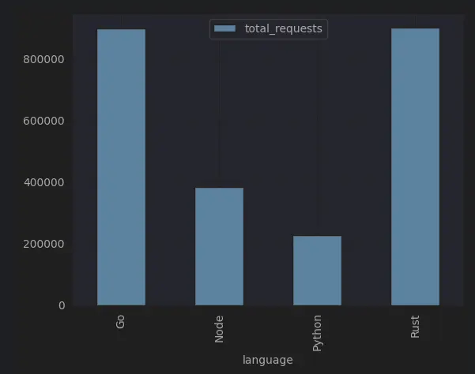
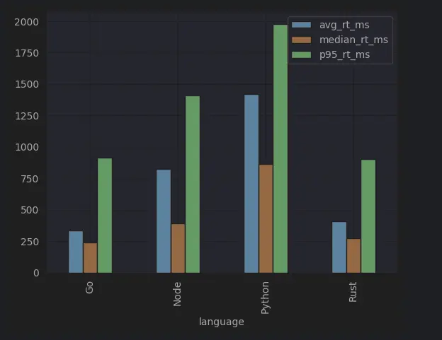
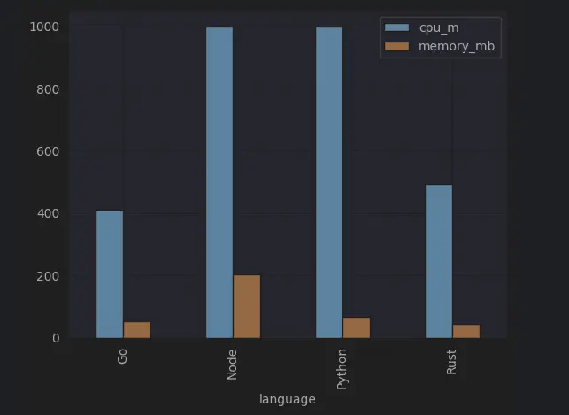

+++
title = "Hello World API Performance Benchmark (Go, Node, Python, Rust)"
date = "2024-09-20"
path = "/posts/2024/09/hello-world-api-performance-benchmark-go-node-python-rust"

[taxonomies]
categories = ["api"]
tags = [  "benchmark", "go","node" ,"python","rust"]

+++

**Correction 2024-09-21**: after using multi-stage build, Node image size dropped from 1.1GB to 130MB.

---

The first programming language I achieved proficiency was Python, so for the longest time I've been using it to do most
stuff. Last year I picked up Go, and I had a blast with it. This month I picked up Rust for data/ml works, and so far I
was very impressed.

It got me thinking - it's been said multiple times is Python is slower than compiled languages, and Node is very easy to
use but uses a lot of memory. Since I can code in multiple languages, why not do a simple API benchmark? So here's the
results.

## Docker image size

It's a given that when you compile your code into a binary, it would be smaller than adding the whole runtime and
dependencies into an image.

| Language | Image Size (MB) |
|----------|----------------|
| Go       | 13.4           |
| Node     | 130            |
| Python   | 146            |
| Rust     | 8.63           |

## Resources utilization on startup

Once we deploy the APIs, this is how much resources they consume on startup.

| Language | CPU Utilization | Memory Utilization |
|----------|-----------------|--------------------|
| Go       | 1               | 1                  |
| Node     | 1               | 56                 |
| Python   | 2               | 35                 |
| Rust     | 1               | 0*                 |

*This is a round-down, which means it utilizes really low amount of RAM.

## API Performance

### Total Requests and Response Time

Given concurrent `5000 VUs` for `120s`, here is total requests you can make in a given duration, with response time.

| Language | Total Requests | AVG RT   | MIN RT | MEDIAN RT | MAX RT | P95 RT   |
|----------|----------------|----------|--------|-----------|--------|----------|
| Go       | 898,131        | 335.77ms | 1.78ms | 239.55ms  | 33.38s | 914.37ms |
| Node*    | 383,091        | 823.61ms | 2.29ms | 393.98ms  | 33.75s | 1.41s    |
| Python*  | 225,929        | 1.42s    | 3.15ms | 861.22ms  | 35.37s | 1.98s    |
| Rust     | 901,038        | 408.57ms | 2ms    | 274.13ms  | 40.77s | 901.35ms |

*Container restarted during peak load

---

For total requests, we can see that Go and Rust have very similar performance, while being the most performant of all.
And Node is faster than Python, but still significantly slower than Go/Rust.

---

But if we are talking about response time, it is very apparent that python is the least performant of all. Go and Rust
is a tie.

### Peak Resources utilization

Turns out Node is the most resource hungry, and Rust uses slightly more CPU than Go.

| Language | CPU (Mi) | Memory (MB) |
|----------|----------|-------------|
| Go       | 410      | 52.48       |
| Node     | 1000     | 203.17      |
| Python   | 1000     | 67.01       |
| Rust     | 492      | 45.49       |

Zooming in on Go and Rust, we can see that Go uses slightly less CPU but more memory than Rust.

## Conclusion

- Python and Node take up the most image size.
- Go and Rust consume the least amount of resources and have very similar performance. While the differences are almost negligible, Rust can serve more requests.
- Node is faster than Python, but utilizes more resources.
