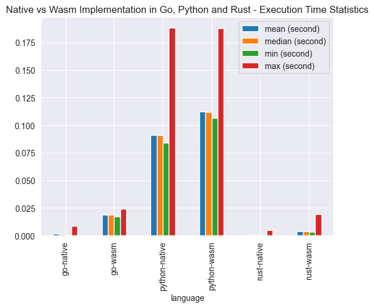
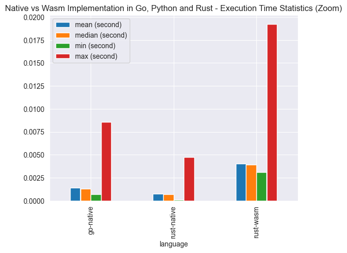
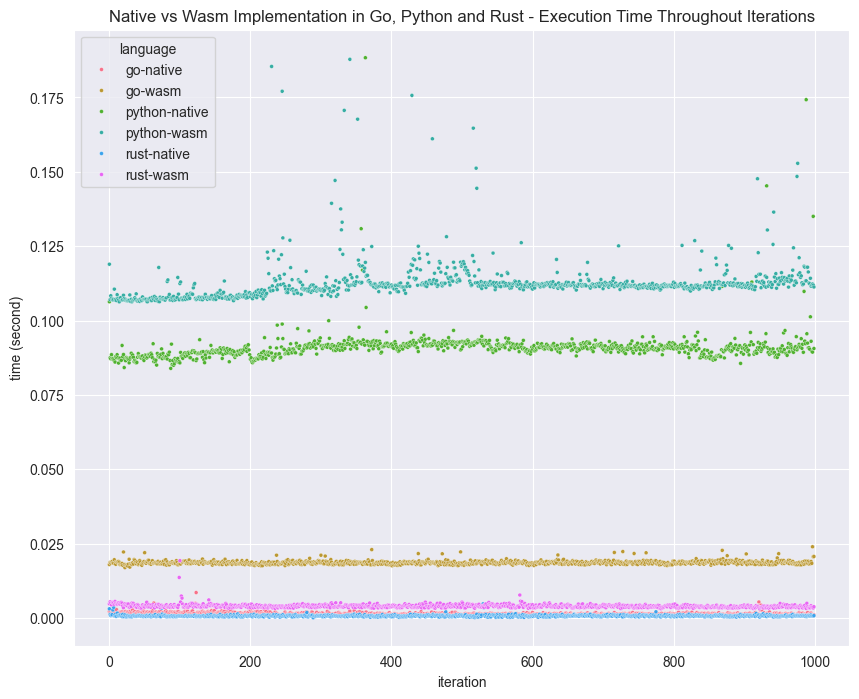
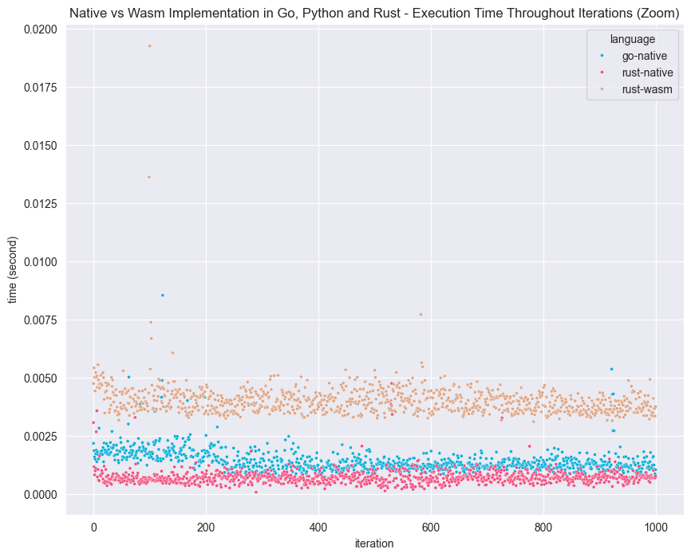

+++
title = "Native Implementation vs Wasm for Go, Python and Rust Benchmark"
date = "2024-12-04"
path = "/posts/2024/12/native-implementation-vs-wasm-for-go-python-and-rust-benchmark"

[taxonomies]
categories = [ "wasm"]
tags = ["benchmark" ,"golang", "python", "rust"]

+++

In 2024 you would hear the term `wasm` pop up now and then. It is not exactly new, but it's gaining more traction due to
wider ecosystem in recent years. Wasm stands for web assembly, essentially it's a format that allows you to execute
binaries in browser runtimes.

Imagine creating a website, and you need to implement a specific function. The problem is that it is much easier to
implement this function in Go, but your website is written in typescript. This happens to be a static site, so a backend
shouldn't be necessary. You can either:

1. Implement this feature as a separate api, and have your website call it - but this would add more overhead to your
   setup
2. write this function in Go, and compile it into wasm and call it in your frontend code

There are bleeding edge use cases for wasm as well, namely utilizing CDN to serve wasm binaries in lieu of maintaining
multi-region infrastructure. The future is interesting.

Nowadays, many languages support compilation into wasm. Since I'm familiar with Go, Python and Rust I'm giving this a
go.

## Experiment Setup

A simple multiply function implemented natively in three languages, which then is compiled into wasm binary with
following setup:

### Go

```bash
GOOS=wasip1 GOARCH=wasm go build -o main.wasm
```

### Python

```bash
uv tool install --python 3.11 py2wasm
py2wasm main.py -o main.wasm
```

### Rust

```bash
rustup target add wasm32-wasip1
cargo build --target wasm32-wasip1 --release
```

Wasm binary is executed via `wasmtime`.

## Benchmark Results

Note: wasm binary execution has a cold start. This means on the first run, it would be significantly slower than
subsequent runs.

### Statistics



At a glance, it is obvious that Python's wasm takes significantly longer than its native implementation. Go's wasm
implementation is also slower. Rust's wasm performance has the least gap with native implementation. Meaning: Rust to
wasm does not result in drastic performance difference.

---



Zooming in, we can see that there is still quite a gap between Rust and Rust's wasm, but it's very miniscule.

### Execution Time Throughout Iterations



For all run iterations, Python plateaus. Go's wasm also stood out.

---



Zooming in, we can clearly see that Rust's wasm is very close to native Go and Rust implementation. In Go and Python, I
actually feel it's longer to run the benchmark, but I didn't notice Rust's wasm taking longer than native Rust at all.

## Conclusion

In terms of performance difference (median) for wasm in Go, Python and Rust:

| Language | Wasm Performance Difference (Second) | Wasm Performance Difference (Percent) |
|----------|--------------------------------------|---------------------------------------|
| Go       | 0.017                                | 1317%                                 |
| Python   | 0.02                                 | 23%                                   |
| Rust     | 0.003                                | 466%                                  |

In terms of actual execution time, Python has the most wasm overhead (at 0.02 second), Go is coming in second at 0.017 second. Rust meanwhile has the least wasm overhead at 0.003 second.

But in terms of percent difference from native implementation, Go has a whopping 1317% longer execution time in wasm. Python while having the most wasm runtime difference, it does not increase much from native implementation (at 23%). Rust still has 466% wasm overhead, but in terms of raw numbers it's only 0.003 second.

Should you use wasm? It depends on your use case. But if you are one of the lucky few who employ Rust developers, why not give it a go? The wasm performance difference won't likely impact your business. Unless you are Cloudflare or Discord.
