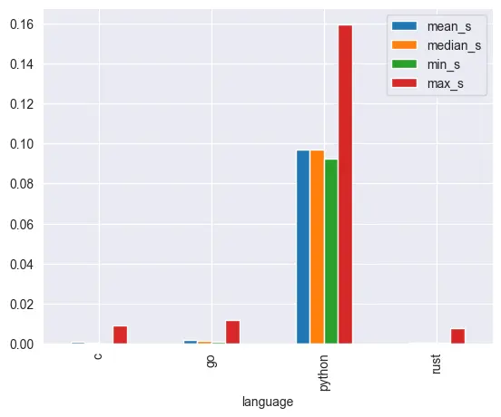
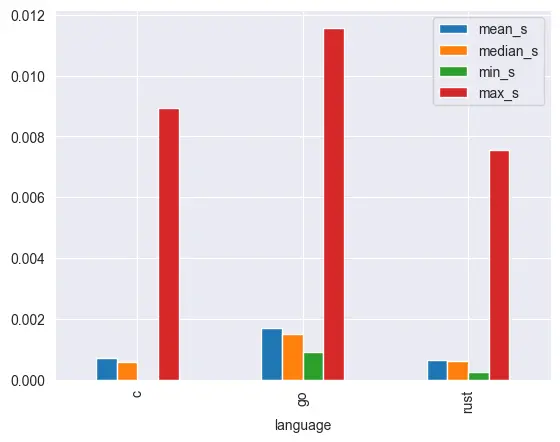
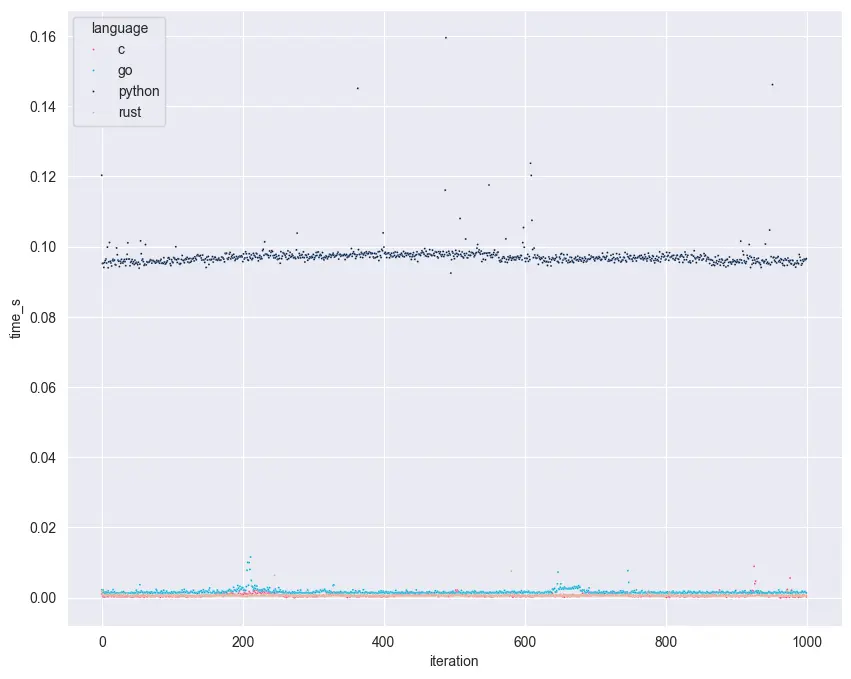
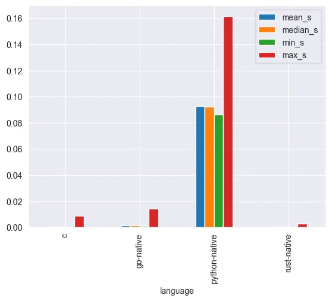
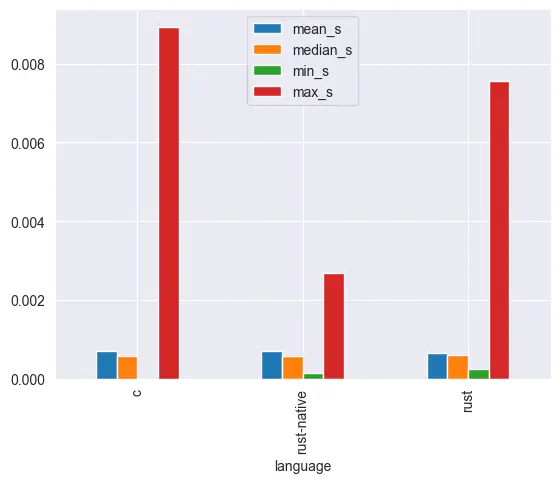
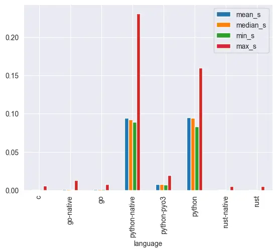

There's a consensus that generally, c is very fast, and python is very slow. But if we are talking about go and rust, you would find that rust is slightly faster than go. So from fastest to slowest: c, rust, go, python.

But what if you have go, python and rust calling c function? There would be more overhead, but how much?

## Calling C from Go, Python and Rust

### Stats

Turns out python has the most overhead.

---

But with go and rust, overheads are more or less negligible, with rust having the least overhead.

### Execution Time

You can see that python execution time plateaued, but go and rust are within the same range as c.

---

You would also notice that go and c have random execution time peaks, but rust is the most stable in terms of execution time. Additionally, calling the same c code, using rust results in the most constant memory usage footprint.

## The Same Function But Implemented Natively

It's the same pattern if native functions are used instead of c foreign function interface.

## Calling C vs Native Function

But if we really have to compare CFFI and native function implementation, `pure rust` is faster than `rust calling c`

### Side-by-side Comparison for Go and Rust

Comparing `pure go` (in blue) and `go calling c`, pure go execution time is faster.

---

With `pure rust` (in rust) and `rust calling c` it's still native implementation faster than CFFI, although with rust, the overhead is more or less negligible.

---

But if we really have to compare `c` and `pure rust` (in rust), c is still faster, but the difference here  is still negligible.

## Bonus

You can also call rust from python via pyo3. In which, for the same function implementation, it is waaaaay faster than CFFI!
