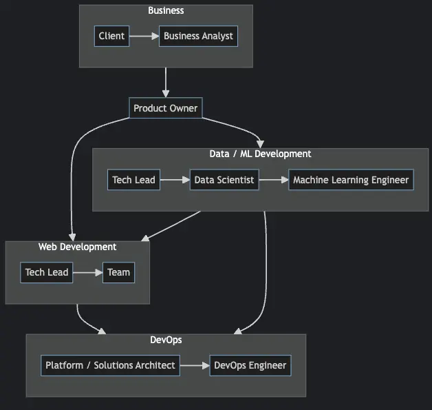

Many data science teams are struggling with implementing end-to-end machine learning projects. It's a very common phenomenon, so if you are experiencing this, you are not alone. Having worked in every stage of data science project lifecycle, in addition to normal web services deployments, this is what I think how we should collaborate.

## Collaboration model between teams

**Note**: The diagram does not signify order of communication. Rather, it states the communication pathways between teams.

1. Clients have problems. Business Analysts gather initial requirements.
2. Project managers plan tasks and timelines, to be discussed with Tech Lead on both Web Development and Data Team
3. Tech Lead on both teams discuss how their services should be integrated, then loop in Platform Engineer / Solutions Architect on the deployment model, in which DevOps Engineer would be the one implementing CI/CD / deployment.
4. Once each Team Lead break down the tasks, the team would start developing services.
5. Specifically for Data Team, once the ML model is working, it would be sent over to Machine Learning Engineer to optimize and  refactor the code, so it's ready for production.
6. After each team has finished development, start integration tests.
7. Once everything is ready, deploy to prod and test again.

## Why involve Web Development team

For web services, there are many frameworks and languages to choose from, ranging from PHP, .NET, NodeJS, etc. But for data works, python is the de-facto language of choice, which means the languages used for web services and data works are different. To which, the solution is to expose data services in REST API / GRPC format, so web services can interact with.

This essentially means both teams should communicate on api endpoints and communications between web and data services. Specifically, how data api would be triggered, and what data to send over, in addition to expected return response from data api.

**This is an over-simplification, which means some details are omitted.**
