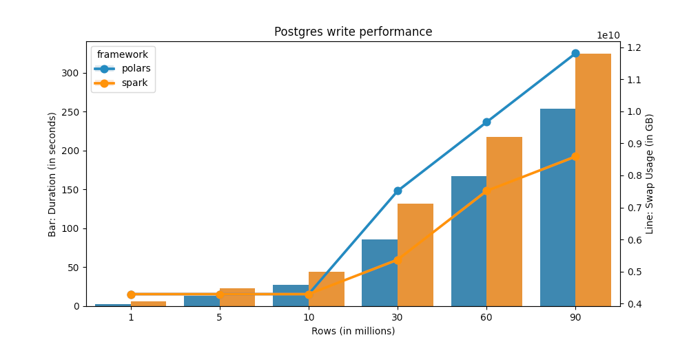

Previously, I talked about [dataframe performance](), but this doesn't include writing data to destination part.

At a large scale, big data means you need to use spark for data processing (unless you prefer SQL, in which this post is irrelevant). But not many orgs need big data, so small data frameworks should work, since they are easier to setup and use compared to spark.

Initially I wanted to include pandas as well, but sadly it performs significantly worse than polars, so only spark and polars remain on the benchmark.

## Benchmark results

Repo is [here](github.com/kahnwong/db-write-performance-benchmark/). The results:

Polars is faster than spark when it comes to writing data to postgres. This is in-line with spark vs polars performance, since polars puts everything in-memory, whereas spark can read from disk. Additionally, spark is a distributed framework, so there is an overhead compared to polars.

Essentially, if your data is small enough (but larger than pandas can deal with) you can use polars. But if your data is very large, consider using spark, so you don't run into scaling issues later on.

## Addendum

Also note that polars can only utilize [sqlalchemy](https://docs.sqlalchemy.org/en/20/dialects/) or [adbc](https://docs.pola.rs/user-guide/io/database/#adbc_1) to write to databases.

For polars, using adbc is faster, since the dataframe doesn't require de-serialization into pandas, but adbc only supports sqlite and postgres.

Sqlalchemy can write to columnar databases, but due to pandas limitations, it's not quite intuitive to split data into chunks then do incremental inserts to a columnar database.

My suggestion would be: if you notice performance degradation for your analytics workload, consider migrating to spark and using columnar database for a warehouse instead.
