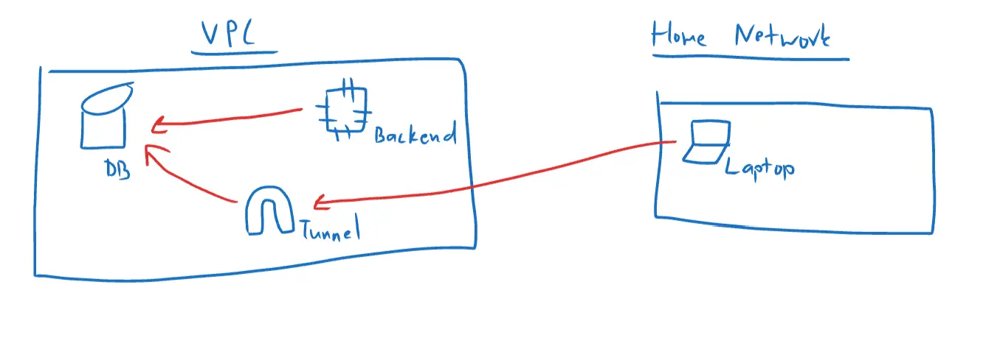
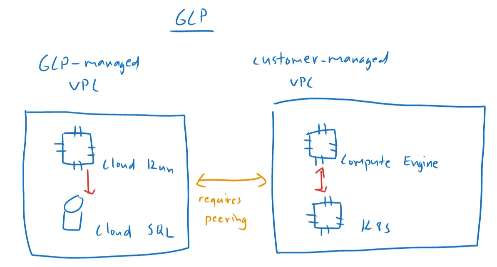
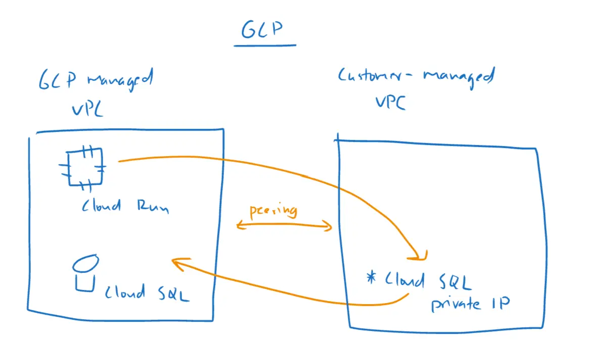

A minimal application architecture would compose of a database, and an application backend. Serverless database is still in its infancy, but thankfully container-based runtime is very much alive and doing well. On GCP, a serverless container-based runtime do exist, known as Cloud Run.

## Standard database access pattern

Per standard security practices, you should not expose your database to public, this means you should use a proxy/tunnel or private network to reach your database.



From above diagram, the Backend instance can access the database directly, since they are within the same VPC. However, for your local machine, you would make a connection to a tunnel, which then forwards your request to the database. This adds another layer of security because access to the tunnel is restricted, meaning not everyone can access your database, even when they know the IP / username / password.

## Cloud Run and and Cloud SQL

With Cloud Run and Cloud SQL, things are a bit different, but for a good reason. Both Cloud Run and Cloud SQL are in GCP-managed VPC, meaning, they can talk to each other directly.



This means, if you are deploying your workloads in a VPC and you need to connect to Cloud SQL, you need to set up VPC peering so your workloads can reach Cloud SQL via private IP.

## Cloud Run configuration

Good news is you only need to set two parameters to reach Cloud SQL from Cloud Run. In Terraform, this would be equivalent to:

```terraform
resource "google_cloud_run_service" "this" {
  name = "cloud-run-cloud-sql-template"

  location = var.region
  project  = var.project_id

  template {
    metadata {
      annotations = {
        "autoscaling.knative.dev/maxScale"         = "100"
        "run.googleapis.com/client-name"           = "cloud-console"
        "run.googleapis.com/cloudsql-instances"    = google_sql_database_instance.this.connection_name
        "run.googleapis.com/execution-environment" = "gen2"
        "run.googleapis.com/startup-cpu-boost"     = "true"
      }
    }
    spec {
      container_concurrency = 80
      service_account_name  = "xxxxxxxxxxxx-compute@developer.gserviceaccount.com"
      timeout_seconds       = 300

      containers {
        image = "asia-southeast1-docker.pkg.dev/xxxxxxxx/cloud-run-cloud-sql-template/cloud-run-cloud-sql-template:xxxxx"

        env {
          name  = "POSTGRES_HOSTNAME"
          value = "/cloudsql/${google_sql_database_instance.this.connection_name}"
        }
        env {
          name  = "POSTGRES_USERNAME"
          value = google_sql_user.this.name
        }
        env {
          name  = "POSTGRES_PASSWORD"
          value = random_password.this.result
        }
        env {
          name  = "POSTGRES_DBNAME"
          value = "postgres"
        }
        env {
          name  = "POSTGRES_PORT"
          value = "5432"
        }
      }
    }
  }
}
```

Essentially, you need to set `run.googleapis.com/cloudsql-instances` under `annotations` to be your `$CloudSQLConnectionName`, and in environment variable, use `/cloudsql/${google_sql_database_instance.this.connection_name}` for `$POSTGRES_HOSTNAME`.

## Why do some tutorials tell me to set up Serverless VPC Access

While setting up Serverless VPC Access would also make Cloud Run able to reach Cloud SQL, this is like taking a detour, because the only difference between the non-serverless-vpc-access approach is the ability to use `private IP` to reach Cloud SQL. By definition, Serverless VPC Access allows serverless services (Cloud Run, Cloud Functions) to reach resources in a VPC using private IP. The network representation would look like this:



## Summary

You don't need to set up networking configurations to get Cloud Run to reach Cloud SQL. Just supply two configurations and it should work.
