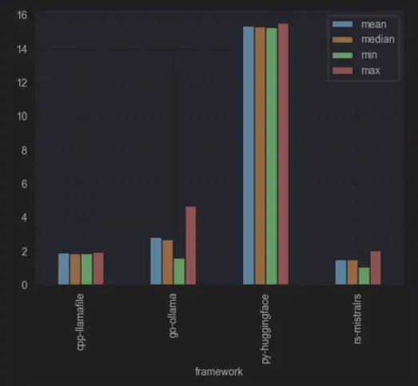
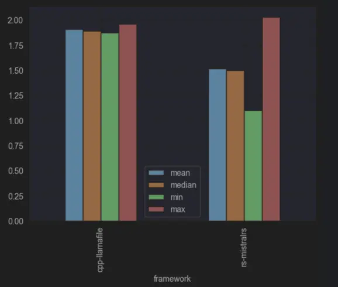
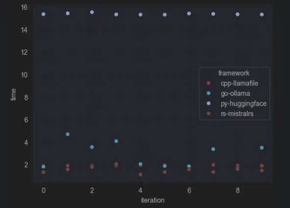
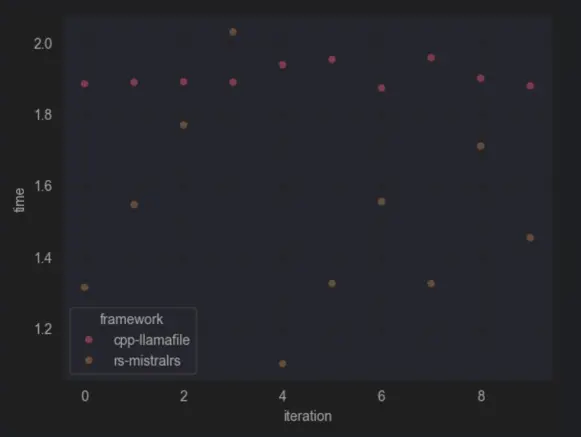

After the rise of ChatGPT in 2023, these days most people are familiar with the concept of LLM - Large Language Model. If you are LLM users, things are looking bright because there are gazillion options for you to choose from.

But if you are on the other side - creating and deploying LLMs, there are certain things you need to think about. For one, your implementation team would have languages/frameworks they specialize in, so that's already a constraint you have to work with when designing a solution.

Thankfully there a myriad of options to choose from to deploy LLMs, (see <https://github.com/Hannibal046/Awesome-LLM?tab=readme-ov-file#llm-deployment>). Even easier if you don't have to do fine-tuning, because you can serve up the model straightaway.

I picked following frameworks to test LLM serving performance:

| Language | Framework   |
|----------|-------------|
| C++      | Llamafile   |
| Go       | Ollama      |
| Python   | HuggingFace |
| Rust     | mistral.rs  |

Let's dive in!

## Baseline Stats

From the chart, HuggingFace via Python takes longest to perform inferences. Llamafile via C++ and mistral.rs via Rust have similar performance, but Ollama via Go has slightly more latency. Ollama is written in Go, which probably explains higher latency due to garbage collection which is bundled in Go binaries.

---

Zooming in Llamafile and mistral.rs, it's clear that mistral.rs performs better. This is most likely from the fact that Rust has better optimizations compared to C++.

## Latency per Iteration

All tests have 10 iterations. From the scatter plot, you can see that sometimes, Llamafile / Ollama / mistral.rs can have very similar performance, but often Ollama takes longer than Llamafile / mistral.rs, which is in-line with the baseline stats from above section. Python still takes the longest, and does not seem to get lower than 14 seconds on each run.

---

Zooming in Llama and mistral.rs, it is clear that mistral.rs has lower latency than Llamafile. Only once Llamafile performs better than mistral.rs.

## Takeaway

Development time and finding the right people to work with you to deploy LLM, Rust-based frameworks yield the best performance.
