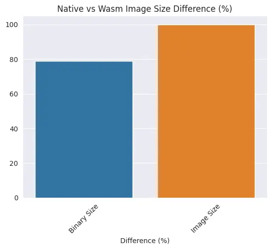
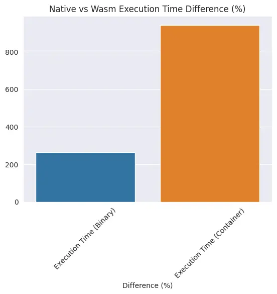

+++
date = "2025-03-10"
path = "/posts/2025/03/wasm-deployment-benchmark"
title = "WASM deployment benchmark"

[taxonomies]
categories = [ "wasm"]
tags = ["benchmark" , "docker"]
+++

Previously, [we've seen how WASM performs](https://karnwong.me/posts/2024/12/native-implementation-vs-wasm-for-go-python-and-rust-benchmark/). But what about delivery methods? This means runtime overhead as well, because executing a raw binary vs container means startup time is involved.

Generally WASM as a binary can be executed in two ways: as a binary or from a container. But it wouldn't be fair to not compare it with native binary (linux/amd64, for example).

## Experiment Design

1. Write a simple rust code to add numbers to an array, and sum the array.
2. Build
   - linux/amd64 binary
   - WASM binary
3. Create a container image
   - linux/amd64
   - wasi/wasm
4. Compare
   - binary vs container size
   - binary vs container execution time (including startup overhead)

[Wasmedge](https://wasmedge.org/docs/develop/deploy/cri-runtime/containerd) is used as a container runtime.

## Results

Below is the raw data.

|arch|binary_size_kb|image_size_kb|execution_time_binary_ms|execution_time_container_ms|
|-|-|-|-|-|
|linux/amd64|477|12900000|13|338.5|
|wasm|100|150|47.5|3531|

### Artifacts Size

We can see that both WASM binary and container image take up less space compared to native architecture.

WASM artifacts, both binary and container image, barely take up any space (100kb for binary, 150kb for container image).

This results in nearly 80% for binary size difference, and 100% for container size difference.

### Execution Time

**Note: linux/amd64 native vs container execution time (excluding container startup overhead) have negligible difference.** This mean we can somewhat attribute the `Execution Time (Container)` axis as container startup overhead.

Binary execution time would be faster, but compound it with container startup time, there's more overhead to run a WASM container.

## Conclusion

WASM is great if you want platform-agnostic deployment. The benefits are that the artifacts size is smaller and it can run on any platform, but at the cost of longer execution time.
