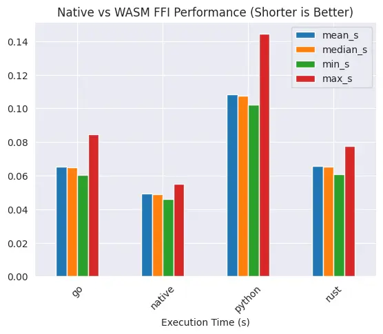
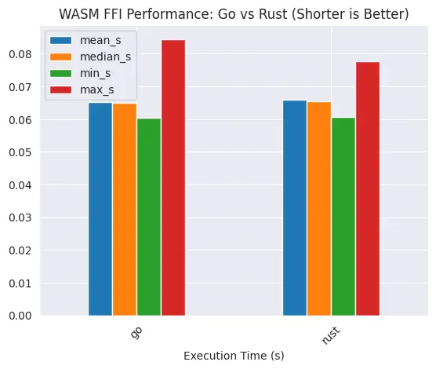
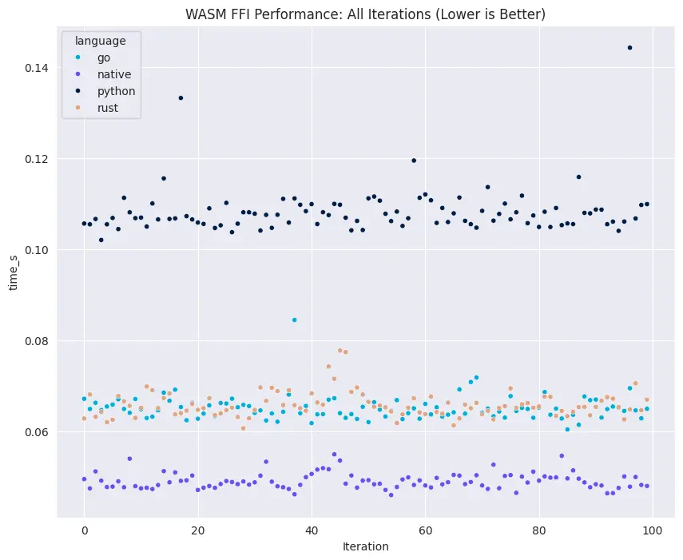

+++
date = "2025-04-15"
path = "/posts/2025/04/wasm-ffi-performance-benchmark"
title = "WASM FFI performance benchmark"

[taxonomies]
categories = ["wasm"]
tags = ["benchmark"]
+++


<br>

WASM is known for being very portable because the only thing it asks for is a browser runtime. This means it doesn't
matter if you have machines on linux/amd64, windows/amd64, darwin/aarch64, WASM can run on all these platforms without
required modifications.

WASM can be used directly, or as an FFI through various languages/SDKs. One common pattern is when you have a
multi-platform apps, the core logic would be compiled into WASM, which is then embedded within app implementations (which can be in Swift for iOS, Kotlin for Android, Electron for web/desktop).

I was curious about the overhead from running WASM through various languages, this is the results.

## Setup

Given [Rust-to-WASM has the best performance](https://karnwong.me/posts/2024/12/native-implementation-vs-wasm-for-go-python-and-rust-benchmark/),
the WASM binary used as FFI would be written in Rust, which then compiled into WASM.

The code is pretty simple: add random numbers to a fix-sized array, then sum the array, and divide it with the array
length.

```rust
use rand::Rng;

fn main() {
    let mut vector: Vec<f64> = Vec::new();
    let loops: i32 = 999999;

    for i in 0..loops {
        let i_float64 = i as f64;
        let random_float = rand::rng().random_range(0.0..999999.0);

        vector.push(random_float * i_float64);
    }

    println!("Vector length: {:?}", vector.len());

    let vector_sum: f64 = vector.iter().sum();
    println!(
        "Vector sum divided by total loops: {:?}",
        vector_sum / loops as f64
    );
}
```

Then execute the WASM binary via wasmtime (native), go, python and rust's wasmtime sdk.

## Raw Numbers

| mean_s   | median_s | min_s    | max_s    | language |
|----------|----------|----------|----------|----------|
| 0.065217 | 0.064873 | 0.060479 | 0.084518 | go       |
| 0.049194 | 0.048882 | 0.046070 | 0.055017 | native   |
| 0.108358 | 0.107370 | 0.102075 | 0.144279 | python   |
| 0.065958 | 0.065392 | 0.060728 | 0.077792 | rust     |

We will revisit this later.

## Benchmark Results

### Statistics



Python takes the longest to execute WASM binary, which is expected since Python is an interpreted language. Running WASM binary directly is also fastest, this makes sense because there's no languages/SDKs overhead.

---



Although it's very surprising to see that Go and Rust have almost similar performance, but `max` value for Go, which is slightly higher than Rust's makes sense due to its garbage collector.

### Execution Time Throughout Iterations



This coincides with above statistics, and you can clearly see that Go and Rust are having almost identical performance.

## Conclusion

Python has the most overhead for running WASM as FFI. Native WASM execution is fastest since there is no SDK overhead.

Go and Rust are slightly slower than Native (`1.62%` difference), but Go and Rust itself are having a `0.8%` gap (`0.000519` second difference).
