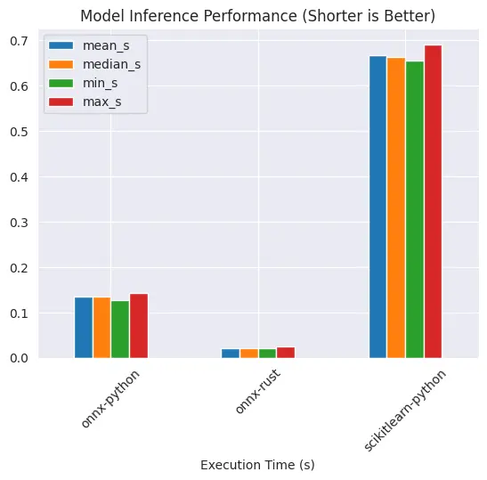

+++
title = 'Model inference in onnx'
date = '2025-06-03'
path = '/posts/2025/06/model-inference-in-onnx'

[taxonomies]
categories = ['data-science', ]
tags = ['benchmark']
+++

Everyone agrees that python is great for data stuff, be it data engineering or machine learning. Although rust is
gaining more traction for data-related applications, python is here to stay.

Those who venture into machine learning are at least familiar with sklearn - a popular framework for machine
learning.

A common use case is you feed it a dataframe (or number arrays) and it will return a mathematical model for you. The
issue is that packaging it to make it production-ready is not trivial, and that you are tied to using python for your
inference code.

While I agree that python is great for data stuff, it really doesn't excel at production where you need reliability and
sensible error handling (I should know... I write go, rust python and I really don't want my worst enemy to deal with
debugging python in production).

But thankfully there's a way out of this - serialize a sklearn model into a portable format (onnx) and serve it in
rust (I tried serving onnx with go, it was very painful - so rust it is).

You can serialize pytorch models into onnx as well, so it's not only limited to classic models.

## Raw Numbers

| mean_s   | median_s | min_s    | max_s    | language           |
|----------|----------|----------|----------|--------------------|
| 0.133962 | 0.134343 | 0.127497 | 0.142944 | onnx-python        |
| 0.021048 | 0.020614 | 0.019894 | 0.024474 | onnx-rust          |
| 0.666279 | 0.662034 | 0.654630 | 0.691337 | scikitlearn-python |

## Model Inference Performance

Native sklearn model is slowest, this is expected. By serializing the model into onnx, python serving performance is significantly better. But it's even faster if you serve onnx via rust.

This means onnx-rust is `552%` faster than onnx-python!!!

Is it 🐍 or 🦥, I'll let you decide.
