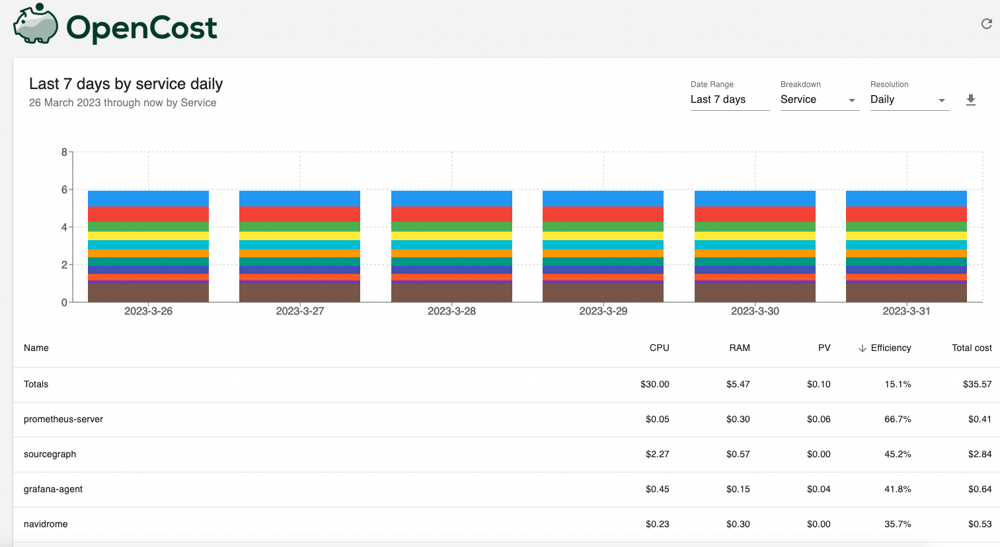

Congratulations, you managed to successfully deployed a few services on kubernetes! But this is not the end 👀. Unfortunately money doesn't grow on trees, and if you can't justify your infra expenses, finance department won't be happy.

If you're using Terraform, you can use [Infracost](https://www.infracost.io/) to create a cost report. Pretty nifty. But what about kubernetes? Given cost reporting is a basic feature, kubernetes is no exception.

Enters [OpenCost](https://www.opencost.io/), a vendor-neutral open source project for measuring and allocating infrastructure and container costs in real time. This also means it is vendor-agnostic. Meaning as long as it's kubernetes, it would work regardless of which cloud it's on (and it works with on-prem setup as well 😉).

Under the hood, it utilizes [prometheus metrics], in conjunction with [provisioned resources for containers - defined in deployment manifest], to calculate cost based on [cloud pricing per compute unit - you can adjust this later].

You can follow OpenCost install instructions [here](https://www.opencost.io/docs/install). Wait for a few days for prometheus to collect usage metrics, and check out OpenCost dashboard. This is what mine looks like:

So that's `$35.57` for `6 days`, which would be around `$5.9 per day`. Per year this would cost `$5.9 * 52 = $306.8` 😱.

My current home server setup is around `$880`, so that's around `3 years` before it would break even 🤣.

But what if we're talking about raw compute price? My server is `8 cores, 64GB RAM, 1TB`, cheapest compute on AWS with similar specs per year is `i4i.2xlarge`, which is `$600 per year`.

Pricing is hard...
