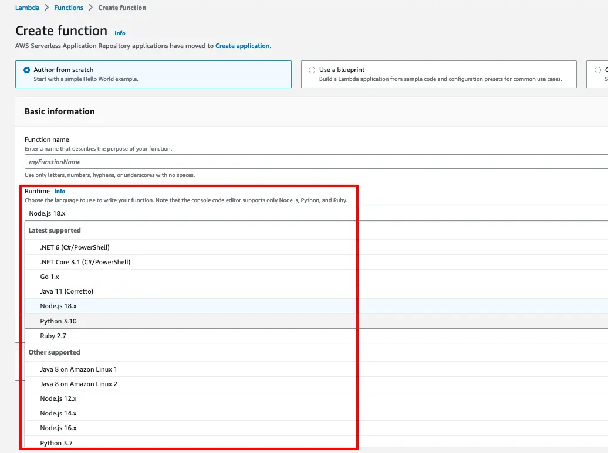

Platform engineering is all the rage these days. Often, you'll often hear this term with the keyword `DevX`. How are they related?

Imagine you are working on a microservice backend. You are just starting out, so you don't have much features to work on yet. But as a PoC, you only need to [fetch data] and [return aggregated price]. You can do microservices on Kubernetes, but you are not familiar with DevOps so you turn to a cloud provider - AWS.

AWS has a service known as Lambda, a serverless computing platform. This basically means "hey we can run your code, and you don't have to manage the infra at all." You go check it out, and you are very pleased to see that Lambda supports a lot of runtime.

## The honeymoon period

You go through the setup wizard, at the end you see a Lambda function goes live, and it also gives you a code editor!

You really love this, because you don't have to go through the `edit code > zip > upload to Lambda > test on Lambda` loop for eternity. You add more lines of code, getting closer to your end product. Then you hit a block because a calculation function you need to use is very hard to do manually, you need to use a library for that. You go looking for a library, and fortune is on your side because you found it. Then you froze, because you just realize that you can't install packages in Lambda, since it doesn't give you a terminal console 😱.

You are a web developer, so you are very familiar with nodejs. Luckily, this is a language you chose for this api, and you also remember that you can just pack `node_modules` folder in your deployment zip image and upload it to Lambda 🎉.

It's almost the end of day, and you are almost done with an MVP. Then you got a call from your project manager, who informed you that you need to add a few features before they can show it to the client. You are not very happy about it, but you understand since you can't go forward with unfinished MVP.

You don't have a lot of time on your hand, since the feature requests were at the last minute. You know this will be a tech debt, but given the time frame, it's the best course of action, so you decide to add more features to existing Lambda function.

These features, it's quite interesting, because they do completely different things, requiring different libraries. You installed a few more packages locally, so you can init new environment on Lambda. You do your usual workflow: `zip > upload > test`, but this time it wouldn't deploy! It ways the package size is too large. But you can still upload the zip package to s3 and submit it as a deployment artifact on Lambda, so you're good for now. You can tell that this project is going to be a success!

## Reality hits

This product did indeed become a success, and you have a few people to help you out on this project. Suddenly you have a realization that "wait the existing `zip > upload > test`" isn't going to work, because you can't collaborate 😥.

## DevX to the rescue

You remember you have a friend who's an ops wizard, she told you of a magical tool known as Docker - a ship shipping ship shipping ship 🐳. You wine and dined your friend, and she spilled this workflow setup:

1. Develop your app like you would locally
2. Define `Dockerfile` for deployment, where the base image is `FROM public.ecr.aws/lambda/python:3.9`, or other runtime of your choice.
3. Setup CI/CD to build image to ECR and deploy to Lambda

She also told you that given this setup, you literally don't have to touch the AWS console, and you can also emulate Lambda via docker as a local endpoint and test it with Postman.

## Platform engineering enters the chat

Your friend's secret sauce works well, but over time you have more teams and services to cover. You also notice that a lot of steps are boilerplates. Your friend was also facing similar issues with her own team. During your weekend hangout, she told you that there's a way out of this: to provide a [base repository for serverless service], in which it contains boilerplate project init, and [base docker image] with common tools installed, so you don't have to waste CI minutes and rebuild it from scratch every time.

Happy ending I think 🤠.
