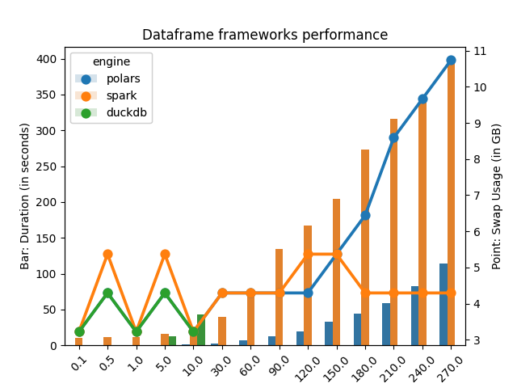
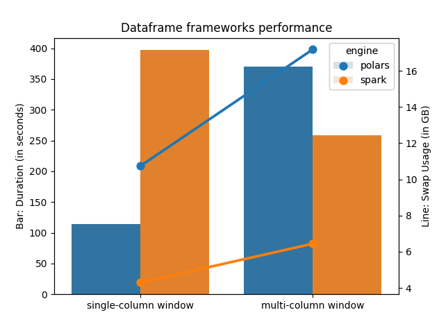

I think everyone who has worked with data, in any role or function, used pandas 🐼 at certain point. I first used pandas in 2017, so it's 6 years already. Things have come a long way, and so is data size I'm working with!

Pandas has its own issues, namely no native support for nested schema. In addition, it's very heavy-handed regarding data types inference. It can be a blessing, but it's a bane for data engineering work, where you have to make sure that your data conforms to agreed-upon schema (hello data contracts!). But the worst issue? Pandas can't open data that doesn't fit into memory. So if you have a 16 GB RAM machine, you can't read 12GB data with pandas 😭.

Rust is all the rage these days, so it's only natural that a dataframe framework would also exist in rust. Polars 🐻‍❄️ is a new kid in town, and it does pack a punch 🥊! Under the hood it uses apache arrow format, so there's no extra overhead for serialization/deserialization. Still, polars isn't a distributed framework. And why is this an issue? Because at certain point, your data would grow larger and larger, and it would no longer be economical to add more resources and ~~hope~~ pray that your polars job won't fail.

But what if your analysts are only comfortable with sql? Then there's DuckDB where it's like SQLite, but on steroids! But then this also pose the same issue as polars, that it doesn't work in a distributed manner.

And we're back to spark, where it's not that easy to setup, but if you get it to work, you pretty much don't have to worry about scaling, since you can have a cluster of spark working in tandem to crunch your pipelines ✨.

## Benchmark result

Enough talking, here's the benchmark:

If you see a small green bar chart for duckdb, the reason there's no values at > 30M rows is because it's been running for 14 minutes, and I would guess it would take much longer to finish the task. For comparison, a spark job against 270M rows only take `400 seconds / 60 seconds = 6.5 minutes`.

Also, notice that the swap usage for spark is almost constant, whereas with polars, it spikes up exponentially post 120M rows 😱. Interestingly, it also parallels spark job runtime. But most pipelines are run in batches at night, so compute time might not be as important in relation to required compute.

## Experiment design

Contrast with most dataframe benchmarks, I intentionally abuse each framework by:

1. Create a timestamp diff column `trip_length_minute`, converted to minute
2. Create percentile on `trip_length_minute` as `trip_length_minute_percentile`
3. Filter only `trip_length_minute_percentile` between (0.2, 0.8)
4. Group by on `VendorID`, `payment_type`
5. Aggregate min, max, avg on `passenger_count`, `trip_distance`, `total_amount`

Input data is equally partitioned into 8 chunks.

Repo is [here](https://github.com/kahnwong/dataframe-frameworks-showdown) if you want run it against different parameters. Please drop me a chart if you see something interesting!

## Update 2023-04-10

What if you Window on multi-key partitions?

Spark wins! Makes sense, since spark can do parallel processing on each partition independently of each other. Also apparently a certain polar bear is very hungry!
