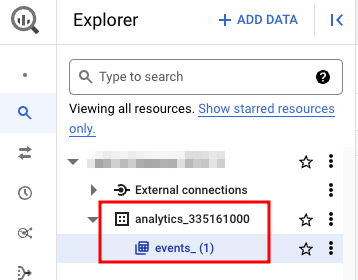

## Background

You want to track who access your site, Google Analytics can do that. To see the data, you can use Google Analytics dashboard, the default settings is good enough for most use cases. But what if you have a lot of tracking data, and you want to streamline a way to analyze it? You could use Data Studio for this, so it's cool for the moment. But what if you want to use Google Analytics data in conjunction with other data? Say, product SKUs? There are multiple ways to achieve that, but one approach that provides a lot of flexibility and allow for long-term maintenance is to write a custom pipeline yourself.

So we're back to grabbing the tracking data and store it somewhere. Google Analytics provide APIs that you can call to obtain the data. This works, with a few caveats... One being that if you have a lot of data, you would run into API rate-limiting 🥲.

But you probably are not the only one who amassed a lot of tracking data, and luckily there's a solution to this problem: dunk Google Analytics data into BigQuery, then you can use Spark to ingest it ✨. (You can set it to "streaming" mode as well, if you want near real-time data.)

## [Setup](https://support.google.com/analytics/answer/9823238?hl=en&ref_topic=9359001#zippy=%2Cin-this-article)

1. Create a new project in GCP console.
2. Enable `BigQuery API`.
3. Go to [Google Analytics console](https://analytics.google.com/) > admin > product links > BigQuery links.
4. Click `Link` > select your BigQuery project where you want to store Google Analytics data.
5. Fill in information as required.
6. Wait for a day. (Initial setup only.)
7. Head back to [BigQuery console](https://console.cloud.google.com/bigquery) and you should see the results.



## Ingestion

You can use any tools you want to read data off BigQuery. Personally I would go with `Spark`, because you can do fine-grained ingestion control that way, and it plays nicely with `s3a` or `gs` protocol for write destination.

```python
spark = (
    SparkSession.builder.config("spark.executor.memory", "4g")
    .config("spark.driver.memory", "4g")
    .config(
        "spark.jars.packages",
        "com.google.cloud.spark:spark-bigquery-with-dependencies_2.12:0.29.0",
    )
    .getOrCreate()
)

df = (
    spark.read.format("bigquery")
    .option("table", "ga4-to-bigquery-xxxxxx.analytics_xxxxxxxxx.events_20230318")
    .load()
)
```

Neato!
