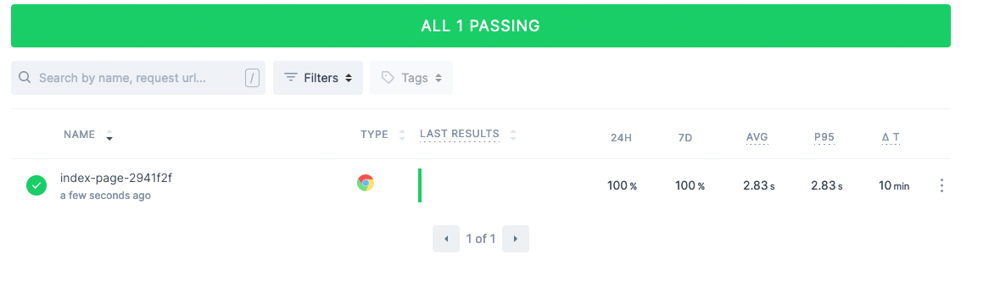

For IaC, no doubt that Terraform is the leader. But there are other alternatives too, one of them is Pulumi. Currently Pulumi provides fun challenges to get started with their services. Best of all, they give you swags too! We are going to create a simple Pulumi project for hosting a static site through Cloudfront CDN.

Challenge url: <https://www.pulumi.com/challenge/startup-in-a-box/>

## Pre-requisites

- [Pulumi](https://app.pulumi.com/signup) account
- [Checkly](https://www.checklyhq.com/) account
- AWS acount
- Install Pulumi cli: `brew install pulumi/tap/pulumi`

## Steps

### Init

Init pulumi project

```bash
mkdir pulumi-challenge-startup-in-a-box
pulumi new aws-typescript
```

### Create S3 bucket

Then we are going to create an s3 bucket to host static website, your `index.ts` should look like this:

```typescript
import * as pulumi from "@pulumi/pulumi";
import * as aws from "@pulumi/aws";
import * as awsx from "@pulumi/awsx";

const bucket = new aws.s3.BucketV2("bucketV2", {
  tags: {
    Name: "pulumi-challenge-karn-wong",
  },
});

const bucketAcl = new aws.s3.BucketAclV2("bAcl", {
  bucket: bucket.id,
  acl: aws.s3.PublicReadAcl,
});
```

### Set MIME type

To set MIME type, we could leverage Node API:

```bash
npm install mime @types/mime
```

Then append this to `index.ts`:

```typescript
import * as fs from "fs";
import * as mime from "mime";
const staticWebsiteDirectory = "website";

fs.readdirSync(staticWebsiteDirectory).forEach((file) => {
  const filePath = `${staticWebsiteDirectory}/${file}`;
  const fileContent = fs.readFileSync(filePath).toString();

  new aws.s3.BucketObject(file, {
    bucket: bucket.id,
    source: new pulumi.asset.FileAsset(filePath),
    contentType: mime.getType(filePath) || undefined,
    acl: aws.s3.PublicReadAcl,
  });
});
```

### Create static assets

But we are going to serve a static website, so we need to provide static assets:

#### `website/index.html`

```html
<!DOCTYPE html>
<html>
  <head>
    <meta charset="utf-8" />
    <title>Pulumi Challenge</title>
    <link rel="stylesheet" href="style.css" />
    <link rel="stylesheet" href="normalize.css" />
  </head>
  <body>
    <header>
      <!-- The logo here is pulled from FontAwesome. Replace it with your own if you like! -->
      <div class="logo">
        <ul>
          <li><i class="fas fa-feather"></i></li>
          <li><p>Company Name</p></li>
        </ul>
      </div>
      <ul class="social">
        <!-- Add your GitHub and social links here! -->
        <li>
          <a href="http://github.com/" target="_blank"
            ><i class="fab fa-github-alt"></i
          ></a>
        </li>
        <li>
          <a href="http://twitter.com/" target="_blank"
            ><i class="fab fa-twitter"></i
          ></a>
        </li>
        <li>
          <a href="http://linkedin.com/" target="_blank"
            ><i class="fab fa-linkedin-in"></i
          ></a>
        </li>
      </ul>
    </header>
    <div class="banner">
      <!-- Fill in the blanks for your startup's pitch! -->
      <h1>Your Startup Name Here</h1>
      <h3>Your Tagline</h3>
      <p>
        We're $CompanyName, and we're changing what it means to $Task. Our
        innovative use of $Technology makes life easier for $JobTitles, so they
        can focus on what they're really good at instead of wasting time and
        effort on $MenialOrDifficultTask. Streamline your $TaskProcess with
        $Product and take to the skies!
      </p>
    </div>
  </body>
  <script
    src="https://kit.fontawesome.com/b4747495ea.js"
    crossorigin="anonymous"
  ></script>
</html>
```

#### `website/style.css`

```css
@import url("https://fonts.googleapis.com/css?family=News+Cycle|Teko&display=swap");

body {
  background-color: #f7f7fa;
  opacity: 0.8;
  background-image: radial-gradient(#f79645 0.5px, #f7f7fa 0.5px);
  background-size: 10px 10px;
}

ul {
  list-style-type: none;
}

ul li {
  display: inline-block;
}

a {
  color: white;
  -webkit-transition: color 0.5s ease-out;
  transition: color 0.5s ease-out;
  text-decoration: none;
}

a:hover,
a:active {
  color: rgb(55, 188, 250);
}

header {
  background-color: rgba(214, 73, 73, 0.6);
  height: 80px;
  position: absolute;
  top: 0;
  width: 100%;
  box-shadow: 0px 2px 7px -1px rgba(0, 0, 0, 0.75);
  -webkit-box-shadow: 0px 2px 7px -1px rgba(0, 0, 0, 0.75);
  -moz-box-shadow: 0px 2px 7px -1px rgba(0, 0, 0, 0.75);
}

header li {
  color: white;
}

.active a {
  color: rgb(255, 157, 112);
}

.social {
  position: absolute;
  right: 50px;
  top: -5px;
  font-size: 30px;
}

.social li {
  margin: 0 5px 0 5px;
}

.logo {
  font-family: Teko;
  position: absolute;
  left: 5px;
  top: -60px;
  font-size: 40px;
}

.banner {
  width: 60vw;
  font-family: Teko;
  font-size: 2vw;
  text-align: center;
  margin-top: 15vw;
  margin-left: 20vw;
}

.banner h1 {
  color: rgb(214, 73, 73);
}

.banner p,
.about p {
  font-family: News Cycle;
}
```

#### `website/normalize.css`

Download from <https://github.com/necolas/normalize.css/blob/master/normalize.css>

### Create Cloudfront CDN

We can always fetch the site via s3 directly, but your s3 bucket is in a single region. Users in far-away-regions might have a significant latency. To circumvent this, we could utilize CDN to reduce the site latency, since CDN would serve the content from a region nearest to users. To achieve this, append the following to `index.ts`:

```typescript
const s3OriginId = "myS3Origin";

const cloudfrontDistribution = new aws.cloudfront.Distribution(
  "s3Distribution",
  {
    origins: [
      {
        domainName: bucket.bucketRegionalDomainName,
        originId: s3OriginId,
      },
    ],
    enabled: true,
    isIpv6Enabled: true,
    comment: "Some comment",
    defaultRootObject: "index.html",
    defaultCacheBehavior: {
      allowedMethods: [
        "DELETE",
        "GET",
        "HEAD",
        "OPTIONS",
        "PATCH",
        "POST",
        "PUT",
      ],
      cachedMethods: ["GET", "HEAD"],
      targetOriginId: s3OriginId,
      forwardedValues: {
        queryString: false,
        cookies: {
          forward: "none",
        },
      },
      viewerProtocolPolicy: "allow-all",
      minTtl: 0,
      defaultTtl: 3600,
      maxTtl: 86400,
    },
    priceClass: "PriceClass_200",
    restrictions: {
      geoRestriction: {
        restrictionType: "whitelist",
        locations: ["US", "CA", "GB", "DE"],
      },
    },
    viewerCertificate: {
      cloudfrontDefaultCertificate: true,
    },
  }
);
```

### Reusable module

Think of it as instead of creating resources manually all the time, you can call a function instead. Refactor away we go!

1. Remove cloudfront block in `index.ts`
2. Create `cdn-website/index.ts` with following content:

```typescript
import * as pulumi from "@pulumi/pulumi";
import * as aws from "@pulumi/aws";
import * as fs from "fs";
import * as mime from "mime";

// This is a simpler verison of:
// https://github.com/pulumi/pulumi-aws-static-website
export class CdnWebsite extends pulumi.ComponentResource {
  private bucket: aws.s3.BucketV2;
  private bucketAcl: aws.s3.BucketAclV2;
  private cloudfrontDistribution: aws.cloudfront.Distribution;
  private s3OriginId: string = "myS3Origin";
  private staticWebsiteDirectory: string = "./website";

  constructor(name: string, args: any, opts?: pulumi.ComponentResourceOptions) {
    super("pulumi:challenge:CdnWebsite", name, args, opts);

    this.bucket = new aws.s3.BucketV2(
      "bucketV2",
      {
        tags: {
          Name: "My bucket",
        },
      },
      {
        parent: this,
      }
    );

    this.bucketAcl = new aws.s3.BucketAclV2(
      "bAcl",
      {
        bucket: this.bucket.id,
        acl: aws.s3.PublicReadAcl,
      },
      {
        parent: this,
      }
    );

    this.cloudfrontDistribution = new aws.cloudfront.Distribution(
      "s3Distribution",
      {
        origins: [
          {
            domainName: this.bucket.bucketRegionalDomainName,
            originId: this.s3OriginId,
          },
        ],
        enabled: true,
        isIpv6Enabled: true,
        comment: "Some comment",
        defaultRootObject: "index.html",
        defaultCacheBehavior: {
          allowedMethods: [
            "DELETE",
            "GET",
            "HEAD",
            "OPTIONS",
            "PATCH",
            "POST",
            "PUT",
          ],
          cachedMethods: ["GET", "HEAD"],
          targetOriginId: this.s3OriginId,
          forwardedValues: {
            queryString: false,
            cookies: {
              forward: "none",
            },
          },
          viewerProtocolPolicy: "allow-all",
          minTtl: 0,
          defaultTtl: 3600,
          maxTtl: 86400,
        },
        priceClass: "PriceClass_200",
        restrictions: {
          geoRestriction: {
            restrictionType: "whitelist",
            locations: ["US", "CA", "GB", "DE"],
          },
        },
        viewerCertificate: {
          cloudfrontDefaultCertificate: true,
        },
      },
      {
        parent: this,
      }
    );

    fs.readdirSync(this.staticWebsiteDirectory).forEach((file) => {
      const filePath = `${this.staticWebsiteDirectory}/${file}`;
      const fileContent = fs.readFileSync(filePath).toString();

      new aws.s3.BucketObject(
        file,
        {
          bucket: this.bucket.id,
          source: new pulumi.asset.FileAsset(filePath),
          contentType: mime.getType(filePath) || undefined,
          acl: aws.s3.PublicReadAcl,
        },
        {
          parent: this.bucket,
        }
      );
    });

    // We also need to register all the expected outputs for this
    // component resource that will get returned by default.
    this.registerOutputs({
      bucketName: this.bucket.id,
      cdnUrl: this.cloudfrontDistribution.domainName,
    });
  }

  get url(): pulumi.Output<string> {
    return this.cloudfrontDistribution.domainName;
  }
}
```

3. In`index.ts` modify the file so that it looks like this:

```typescript
// Deploy Website to S3 with CloudFront
// Also shows the challenger how to build a ComponentResource
import { CdnWebsite } from "./cdn-website";

const website = new CdnWebsite("your-startup", {});
```

### Sanity checks

If everything works correctly, we should be able to deploy the website. But it would be so much better if we can see whether the website is working normally or not. Status checks to the rescue!

Here we set up `checkly` provider:

```bash
npm install @checkly/pulumi

# API KEY: https://app.checklyhq.com/settings/account/api-keys
pulumi config set checkly:apiKey --secret

# AccountID: https://app.checklyhq.com/settings/account/general
pulumi config set checkly:accountId
```

Then append this to `index.ts`:

```typescript
export const websiteUrl = website.url;

import * as checkly from "@checkly/pulumi";
import * as fs from "fs";

new checkly.Check("index-page", {
  activated: true,
  frequency: 10,
  type: "BROWSER",
  locations: ["eu-west-2"],
  script: websiteUrl.apply((url) =>
    fs
      .readFileSync("checkly-embed.js")
      .toString("utf8")
      .replace("{{websiteUrl}}", url)
  ),
});
```

But we need to supply logic for sanity checks, we can do this by creating `checkly-embed.js` (which the above checkly resource fetches).

```typescript
const playwright = require("playwright");
const expect = require("expect");

const browser = await playwright.chromium.launch();
const page = await browser.newPage();

await page.goto("https://{{websiteUrl}}");
expect(await page.title()).toBe("Pulumi Challenge");

await browser.close();
```

### Cherry on top (who wants swags?)

Kindly provided by folks at Pulumi, we can get cool swags by calling an API endpoint as follows:

```bash
npm install got@11.8.0
```

Then paste the following in `swag-provider/index.ts`:

```typescript
import * as pulumi from "@pulumi/pulumi";

const submittionUrl: string =
  "https://hooks.airtable.com/workflows/v1/genericWebhook/apptZjyaJx5J2BVri/wflmg3riOP6fPjCII/wtr3RoDcz3mTizw3C";

interface SwagInputs {
  name: string;
  email: string;
  address: string;
  size: "XS" | "S" | "M" | "L" | "XL" | "XXL" | "XXXL";
}

interface SwagCreateResponse {
  success: boolean;
}

interface SwagOutputs extends SwagInputs {
  id: string;
}

class SwagProvider implements pulumi.dynamic.ResourceProvider {
  private name: string;

  constructor(name: string) {
    this.name = name;
  }

  async create(props: SwagInputs): Promise<pulumi.dynamic.CreateResult> {
    const got = (await import("got")).default;

    let data = await got
      .post(submittionUrl, {
        headers: {
          "Content-Type": "application/json",
        },
        json: {
          ...props,
        },
      })
      .json<SwagCreateResponse>();

    return { id: props.email, outs: props };
  }
}

export class Swag extends pulumi.dynamic.Resource {
  constructor(
    name: string,
    props: SwagInputs,
    opts?: pulumi.CustomResourceOptions
  ) {
    super(new SwagProvider(name), name, props, opts);
  }
}
```

Finally, paste this to `index.ts`:

```typescript
import { Swag } from "./swag-provider";

const swag = new Swag("your-startup", {
  name: "YOUR NAME",
  email: "YOUR EMAIL",
  address: "YOUR ADDRESS",
  size: SIZE,
});
```

### Open sesame

'Nuff said

```bash
pulumi up
```

If everything works correctly, your terminal should display something like this:

```bash
Previewing update (dev)

View Live: https://app.pulumi.com/kahnwong/pulumi-challenge-startup-in-a-box/dev/previews/xxxxxxxx

     Type                               Name                                   Plan
 +   pulumi:pulumi:Stack                pulumi-challenge-startup-in-a-box-dev  create
 +   ├─ pulumi:challenge:CdnWebsite     your-startup                           create
 +   │  ├─ aws:s3:BucketV2              bucketV2                               create
 +   │  │  ├─ aws:s3:BucketObject       index.html                             create
 +   │  │  ├─ aws:s3:BucketObject       style.css                              create
 +   │  │  └─ aws:s3:BucketObject       normalize.css                          create
 +   │  ├─ aws:s3:BucketAclV2           bAcl                                   create
 +   │  └─ aws:cloudfront:Distribution  s3Distribution                         create
 +   ├─ pulumi-nodejs:dynamic:Resource  your-startup                           create
 +   └─ checkly:index:Check             index-page                             create

Outputs:
    websiteUrl: output<string>

Resources:
    + 10 to create

Do you want to perform this update? yes
Updating (dev)

View Live: https://app.pulumi.com/kahnwong/pulumi-challenge-startup-in-a-box/dev/updates/1

     Type                               Name                                   Status
 +   pulumi:pulumi:Stack                pulumi-challenge-startup-in-a-box-dev  created
 +   ├─ pulumi:challenge:CdnWebsite     your-startup                           created
 +   │  ├─ aws:s3:BucketV2              bucketV2                               created
 +   │  │  ├─ aws:s3:BucketObject       style.css                              created
 +   │  │  ├─ aws:s3:BucketObject       index.html                             created
 +   │  │  └─ aws:s3:BucketObject       normalize.css                          created
 +   │  ├─ aws:cloudfront:Distribution  s3Distribution                         created
 +   │  └─ aws:s3:BucketAclV2           bAcl                                   created
 +   ├─ pulumi-nodejs:dynamic:Resource  your-startup                           created
 +   └─ checkly:index:Check             index-page                             created

Outputs:
    websiteUrl: "dyacxs5ksi1r9.cloudfront.net"

Resources:
    + 10 created

Duration: 3m25s
```

Don't you love it when everything works as you planned 😎.



To teardown all resources, run `pulumi destroy`. If successful, your terminal should return:

```bash
Previewing destroy (dev)

View Live: https://app.pulumi.com/kahnwong/pulumi-challenge-startup-in-a-box/dev/previews/xxxxxxxx

     Type                               Name                                   Plan
 -   pulumi:pulumi:Stack                pulumi-challenge-startup-in-a-box-dev  delete
 -   ├─ checkly:index:Check             index-page                             delete
 -   ├─ pulumi-nodejs:dynamic:Resource  your-startup                           delete
 -   └─ pulumi:challenge:CdnWebsite     your-startup                           delete
 -      ├─ aws:cloudfront:Distribution  s3Distribution                         delete
 -      ├─ aws:s3:BucketAclV2           bAcl                                   delete
 -      └─ aws:s3:BucketV2              bucketV2                               delete
 -         ├─ aws:s3:BucketObject       normalize.css                          delete
 -         ├─ aws:s3:BucketObject       style.css                              delete
 -         └─ aws:s3:BucketObject       index.html                             delete

Outputs:
  - websiteUrl: "dyacxs5ksi1r9.cloudfront.net"

Resources:
    - 10 to delete

Do you want to perform this destroy? yes
Destroying (dev)

View Live: https://app.pulumi.com/kahnwong/pulumi-challenge-startup-in-a-box/dev/updates/2

     Type                               Name                                   Status
 -   pulumi:pulumi:Stack                pulumi-challenge-startup-in-a-box-dev  deleted
 -   ├─ checkly:index:Check             index-page                             deleted
 -   ├─ pulumi-nodejs:dynamic:Resource  your-startup                           deleted
 -   └─ pulumi:challenge:CdnWebsite     your-startup                           deleted
 -      ├─ aws:cloudfront:Distribution  s3Distribution                         deleted
 -      ├─ aws:s3:BucketAclV2           bAcl                                   deleted
 -      └─ aws:s3:BucketV2              bucketV2                               deleted
 -         ├─ aws:s3:BucketObject       index.html                             deleted
 -         ├─ aws:s3:BucketObject       normalize.css                          deleted
 -         └─ aws:s3:BucketObject       style.css                              deleted

Outputs:
  - websiteUrl: "dyacxs5ksi1r9.cloudfront.net"

Resources:
    - 10 deleted

Duration: 3m22s

The resources in the stack have been deleted, but the history and configuration associated with the stack are still maintained.
If you want to remove the stack completely, run `pulumi stack rm dev`.
```
