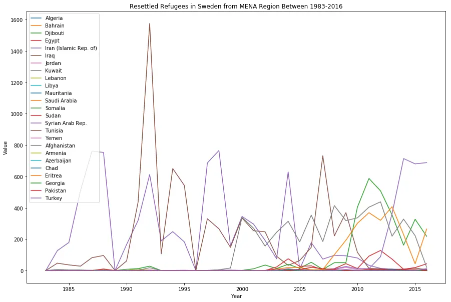
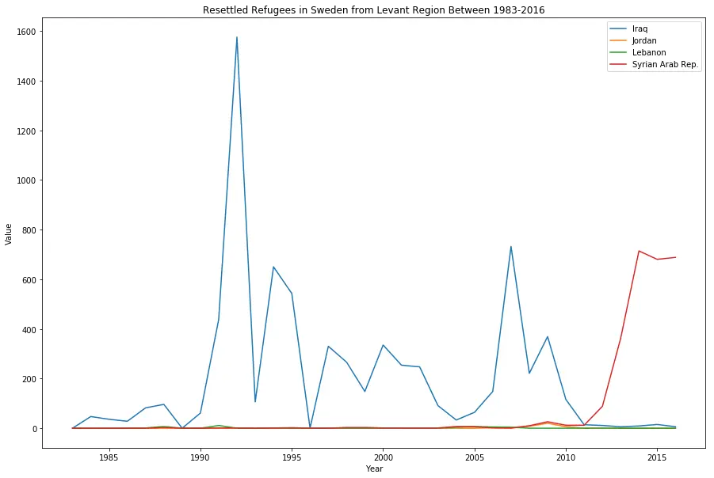
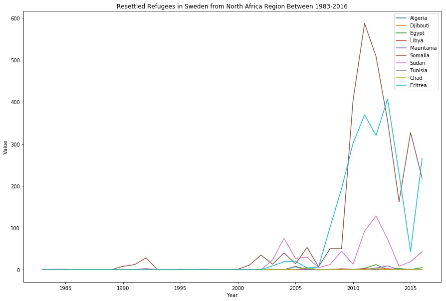

One of my friends is a Syrian refugee, who was granted asylum in Sweden last year. I also want to try data analysis, so it fits that I should analyze something that's relevant to my friend. This is my first ever analysis in pandas, apologies for code abomination in advance.

In this analysis, I use pandas for dataframe, numpy for dealing with numbers (because I need to count and do some math with it) and matplotlib for plotting graphs.

```python
import numpy as np
import pandas as pd
import matplotlib.pyplot as plt
%matplotlib inline
```

The next step is to clean up the dataframe for further analysis. The steps are:

- Read csv
- Group by origin country and year resettled
- Remove destination country column (because it's the same value)
- Remove non-integer values (because you can't do math magic with it)
- Convert year and value to integer (hello, math magic)

```python
## data prep
df = pd.read_csv('unhcr_resettlement_residence_swe.csv')[1:]
df = df.groupby(['Origin', 'Year'], as_index=False).sum() # group by two columns
df = df.drop('Country / territory of asylum/residence', axis=1) # drop destination country column
df = df[(df != '*').all(1)] # remove any rows that has '*' value
df.Year = df.Year.astype(np.int64) # convert year to int
df.Value = df.Value.astype(np.int64) # convert value to int

df
```

<style>.my-black-bordered-table table, th, td { border: 1px solid black; border-collapse: collapse; }</style>

<div class="ox-hugo-table my-black-bordered-table">
<div></div>

|        | Origin                               | Year   | Value  |
| ------ | ------------------------------------ | ------ | ------ |
| 0      | Afghanistan                          | 1984   | 7      |
| 1      | Afghanistan                          | 1985   | 4      |
| 2      | Afghanistan                          | 1986   | 4      |
| 3      | Afghanistan                          | 1987   | 1      |
| 4      | Afghanistan                          | 1988   | 1      |
| 5      | Afghanistan                          | 1991   | 2      |
| 6      | Afghanistan                          | 1992   | 18     |
| 7      | Afghanistan                          | 1997   | 1      |
| 8      | Afghanistan                          | 1998   | 5      |
| 9      | Afghanistan                          | 1999   | 16     |
| 10     | Afghanistan                          | 2000   | 339    |
| 11     | Afghanistan                          | 2001   | 270    |
| 12     | Afghanistan                          | 2002   | 156    |
| 13     | Afghanistan                          | 2003   | 244    |
| 14     | Afghanistan                          | 2004   | 314    |
| 15     | Afghanistan                          | 2005   | 183    |
| 16     | Afghanistan                          | 2006   | 353    |
| 17     | Afghanistan                          | 2007   | 185    |
| 18     | Afghanistan                          | 2008   | 414    |
| 19     | Afghanistan                          | 2009   | 318    |
| 20     | Afghanistan                          | 2010   | 336    |
| 21     | Afghanistan                          | 2011   | 404    |
| 22     | Afghanistan                          | 2012   | 438    |
| 23     | Afghanistan                          | 2013   | 219    |
| 24     | Afghanistan                          | 2014   | 328    |
| 25     | Afghanistan                          | 2015   | 222    |
| 26     | Afghanistan                          | 2016   | 20     |
| 27     | Albania                              | 1991   | 1      |
| 28     | Albania                              | 1992   | 1      |
| 29     | Albania                              | 2003   | 3      |
| \.\.\. | \.\.\.                               | \.\.\. | \.\.\. |
| 705    | Various/unknown                      | 2009   | 2      |
| 706    | Various/unknown                      | 2013   | 2      |
| 707    | Venezuela \(Bolivarian Republic of\) | 2015   | 4      |
| 708    | Viet Nam                             | 1984   | 76     |
| 709    | Viet Nam                             | 1985   | 48     |
| 710    | Viet Nam                             | 1986   | 171    |
| 711    | Viet Nam                             | 1987   | 232    |
| 712    | Viet Nam                             | 1988   | 94     |
| 713    | Viet Nam                             | 1990   | 939    |
| 714    | Viet Nam                             | 1991   | 656    |
| 715    | Viet Nam                             | 1992   | 474    |
| 716    | Viet Nam                             | 1993   | 197    |
| 717    | Viet Nam                             | 1994   | 32     |
| 718    | Viet Nam                             | 1995   | 4      |
| 719    | Viet Nam                             | 1997   | 21     |
| 720    | Viet Nam                             | 2002   | 1      |
| 721    | Viet Nam                             | 2004   | 10     |
| 722    | Viet Nam                             | 2006   | 10     |
| 723    | Viet Nam                             | 2009   | 2      |
| 724    | Viet Nam                             | 2010   | 6      |
| 726    | Yemen                                | 1992   | 1      |
| 727    | Yemen                                | 2004   | 1      |
| 728    | Yemen                                | 2005   | 4      |
| 729    | Yemen                                | 2006   | 1      |
| 730    | Zimbabwe                             | 2006   | 4      |
| 731    | Zimbabwe                             | 2008   | 1      |
| 732    | Zimbabwe                             | 2011   | 1      |
| 733    | Zimbabwe                             | 2014   | 7      |
| 734    | Zimbabwe                             | 2015   | 6      |
| 735    | Zimbabwe                             | 2016   | 9      |

725 rows × 3 columns

Since I want to plot a multiple line graph, I need to supply one dataframe per each line. This step is to create one dataframe per source country and clean it up. For example, if there is one year where no refugees are resettled, that year doesn't exist in the dataframe, so I have to check whether the years are missing or not, and if missing, create it and set the value to 0.

```python
## create one dataframe per one origin country
UniqueNames = df.Origin.unique()
DataFrameDict = {elem : pd.DataFrame for elem in UniqueNames}

for key in DataFrameDict.keys():
    DataFrameDict[key] = df[:][df.Origin == key]

def clean_up_dataframe(df):
    country = df.Origin.unique()[0]
    df = df.drop('Origin', axis=1)
    df.index = df.Year
    df = df.drop('Year', axis=1)
    df = df.rename(columns={'Value': country})

    df2 = pd.DataFrame({'Year':range(1983,2016+1), country:0}) # dummy dataframe
    df2.index = df2.Year
    df2[country] = df[country]
    df2 = df2.fillna(0)
    df2 = df2[country]

    return df2
```

And because Syria is in the Middle East, I want to focus in the MENA region (Middle East and North Africa). However, the list is too big, and I've yet to figure out how to make it look pretty. What I do instead is group countries into each subregion and plot them.

```python
## orginal MENA, too big
UniqueNames_og_mena = ['Algeria', 'Bahrain', 'Djibouti', 'Egypt', 'Iran', 'Iraq', 'Israel', 'Jordan',
'Kuwait', 'Lebanon', 'Libya', 'Mauritania', 'Morocco', 'Oman', 'Palestine', 'Qatar',
'Sahrawi Arab Democratic Republic', 'Saudi Arabia', 'Somalia', 'Sudan', 'Syria', 'Tunisia',
'United Arab Emirates', 'Yemen', 'Afghanistan', 'Armenia', 'Azerbaijan', 'Chad', 'Comoros',
'Cyprus', 'Eritrea', 'Georgia', 'Mali', 'Niger', 'Pakistan', 'Turkey']

## MENA
UniqueNames_mena = ['Algeria', 'Bahrain', 'Djibouti', 'Egypt', 'Iran (Islamic Rep. of)', 'Iraq', 'Jordan',
               'Kuwait', 'Lebanon', 'Libya', 'Mauritania', 'Saudi Arabia', 'Somalia', 'Sudan',
               'Syrian Arab Rep.', 'Tunisia', 'Yemen', 'Afghanistan',
               'Armenia', 'Azerbaijan', 'Chad', 'Eritrea', 'Georgia', 'Pakistan', 'Turkey']

## LEVANT
UniqueNames_levant = [ 'Iraq', 'Jordan', 'Lebanon', 'Syrian Arab Rep.']

## NORTH AFRICA
UniqueNames_north_africa = ['Algeria', 'Djibouti', 'Egypt', 'Libya', 'Mauritania',  'Somalia', 'Sudan',
                'Tunisia', 'Chad', 'Eritrea']

def plot(region_name, region_list):
    df1 = clean_up_dataframe(DataFrameDict[region_list[0]])
    ax = df1.plot(figsize=(15,10))

    for i in region_list[1:]:
        df = clean_up_dataframe(DataFrameDict[i])
        df.plot(ax=ax)

    plt.xlabel('Year')
    plt.ylabel('Value')
    plt.title('Resettled Refugees in Sweden from {} Region Between 1983-2016'.format(region_name))
    ax.legend()

    plt.show()

## plot('All MENA', UniqueNames_og_mena) # list is too big
```

```python
plot('MENA', UniqueNames_mena)
```



You can see that a lot of Iraqi refugees resettled between 1990-1995, which coincides with the Gulf War (1990-1).

```python
plot('Levant', UniqueNames_levant)
```



This graph shows only refugees from the Levant region. As expected, a lot of Iraqis sought asylum during the 90's, but Syrian refugees spiked up after 2010, which coincides with Arab Spring (2010-2).

```python
plot('North Africa', UniqueNames_north_africa)
```



In North Africa, Somalian refugees spiked up around 2010, which is the result from non-functioning government, which resulted in rising clan wars. Additionally, you can see that there are a lot of Eritrean refugees too, from indefinite conscription. Families of those who fled the military are also targeted.
