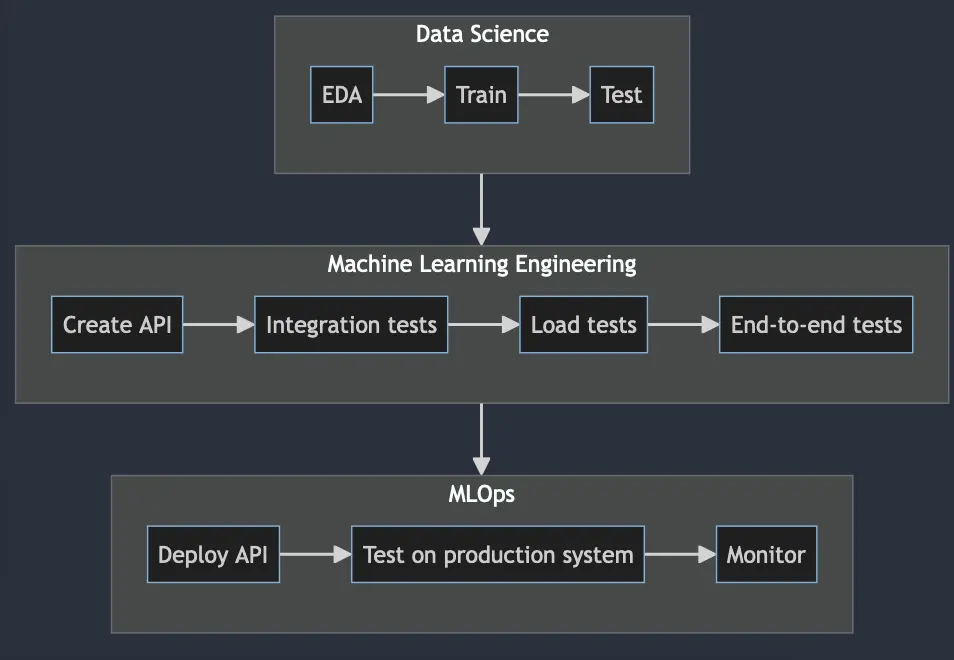

Over the years I've heard stories of data teams struggling with deploying machine learning models to production. Clearly
there is a pattern here. This article is my reflection on the matter.

## So what's the problem?

Data scientists, by definition, create mathematical models from data so some unknowns can become known. This is
colloquially known as "prediction."  For example, if you have sales data from last year, you can use it to forecase
sales performance of next year.

The fun starts when data scientists have to "deploy" models to production, because their expertise do not always extend
to what are required to deploy models to production.

Below is a diagram of machine learning project workflow, abridged to only include steps from data team's perspective,
excluding web development.

## The difference between data science, machine learning engineering and MLOps

There are multiple definitions for data scientist and machine learning engineer, but a common theme for each is that:

| Role                      | Area of Focus                                                             |
|---------------------------|---------------------------------------------------------------------------|
| Data Scientist            | Create mathematical models                                                |
| Machine Learning Engineer | Make sure mathematical models can be deployed                             |
| MLOps                     | Deploy mathematical models and make sure the system is up and operational |

As you can see, machine learning engineering is more closely aligned with software engineering, which makes sense why data
scientists are struggling with model deployments, because it's a territory they are unfamiliar with.

In the same vein, mlops is a subtype of devops, which utilizes different skills set than machine learning engineering.
MLOps main focus is to make sure the whole pipelines are running smoothly and that the systems are operational.

## Why a separate MLOps role

Refer to software engineering vs devops, it's the same debate. The gist is that developing a system and monitoring it
are different, plus there are many things to consider when deploying a workload, especially things that don't happen in
development workflow.

For one, you can't deploy an app the same way as ML api endpoint. The resources requirements are different, and
packaging ML system is trickier than an app, seeing some requires GPU during inference, etc.

Also monitoring is different, since you have to factor in data and model drift as well. In
addition, [the inference api] / [the backend calling an inference api] have to log input/output so the team can do back
testing and adjust the models post-initial deployment, seeing the nature of training / users input data do affect the
model prediction.

## Do people who can do all these exist?

They do, but they are not your average engineers. If you do find them, congratulations!
