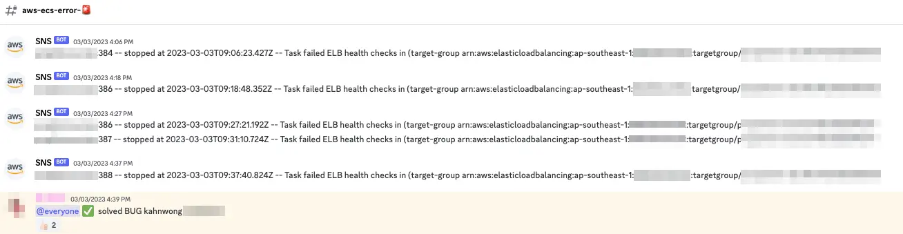

Imagine having multiple services running, each has its own logs. Most people don't read them, and they shouldn't, because services emit a lot of logs! But we need them, because it's the only way to diagnose and troubleshoot system errors. But you might say "my service is not a system! It's only doing tiny stuff!" Gotta break it to you, your small part is a piece in a large system networks stitched together! So your seemingly-tiny service is also important!

So how do people monitor logs? Actually they don't. To actually do that, you need to do a lot of mouse-scrolling, and reading a lot of redundant logs but with different identifiers - which doesn't sound glamorous. What usually happens is, people set up alerts on logs, so when alerts are triggered, someone would be going through the logs to investigate the issue. Now it's more like a murder mystery!

What if it's not with applications logs but services status? Say, your service deployments on AWS ECS. Luckily you can still utilize the same concept as above: intercept the logs and sent out alerts based on a trigger.

One instance where you might want to send alerts on services status is for services autoscaling, so you know when there's a spike in traffic. The issue isn't with the increased cost for your compute, rather to monitor related services to make sure they are operational. Hello databases, api endpoints, etc.

This is important because, your service on autoscaling might be your backend. You can have multiple instances of backend services, but they might be pointing to the same database or api endpoints. Service health on auxiliary services are important, since this is your backend service's bottleneck.

If you're on AWS, you can utilize Cloudwatch Events to send out messages based on a trigger via Lambda. Basically:

1. ECS emits metrics / logs to Cloudwatch
2. Alerts (Cloudwatch Alarms) are set to trigger on specific events (e.g. service {scale up | scale down | stop})
3. Alert events are sent to SNS, so it can trigger actions we want after receiving alerts
4. Actions are defined via a Lambda function to send out messages

There's a lot of jumps there, so to recap: ECS -> Cloudwatch Alarms -> SNS -> Lambda.

So what about ChatOps? Let's say the whole point of this setup is to send out alerts, where do you think people would have the most chance to see?

Yup, in their work slack, or discord, or whatever people use. This way, service alerts are public, and everyone can see it. It's even better than email because it's not really made for real-time communication... Which means for critical alerts we might want to work with latest alerts, and collaborate to help mitigate the issue. And one of the biggest benefits is that you don't have to seek out the alerts, instead they come to you! (Now you can't use excuses like "I forgot to monitor the alerts!")

For my organization's workspace, we have set up alerts for ECS services status, to see when scaling or service termination happens. This especially comes in handy during a new service deployment, when if we see service termination alerts for the same service in succession, it means there's issues with this deployment, this limits the blast radius so we can pinpoint the likely root cause.

One time, someone merged a PR and suddenly we see a lot of service termination alerts. Turns out, this commit introduced a new feature that requires a new environment variable, but it wasn't added in the deployment specs yet. This also allows for fast feedback cycle, so you have an easier to time to trace your steps for likely event(s) that caused a service disruption.

Ops is easy, said no one, I think 😅.
