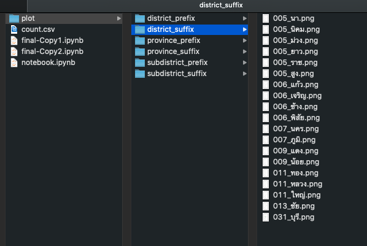
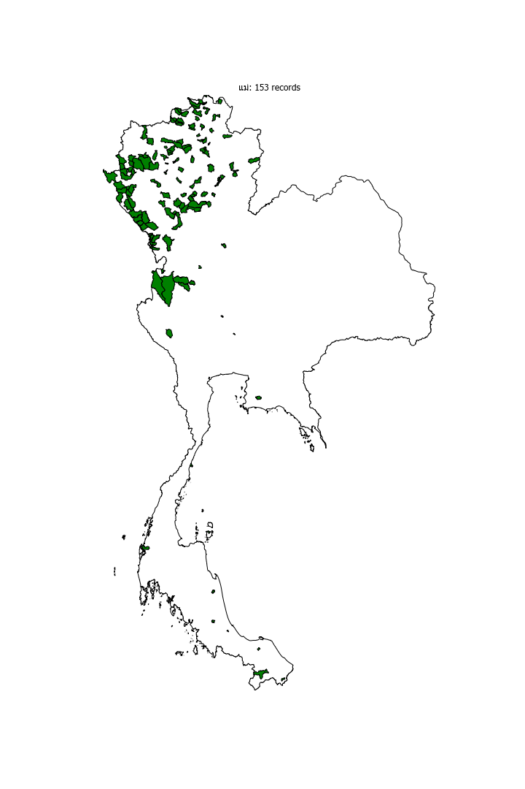
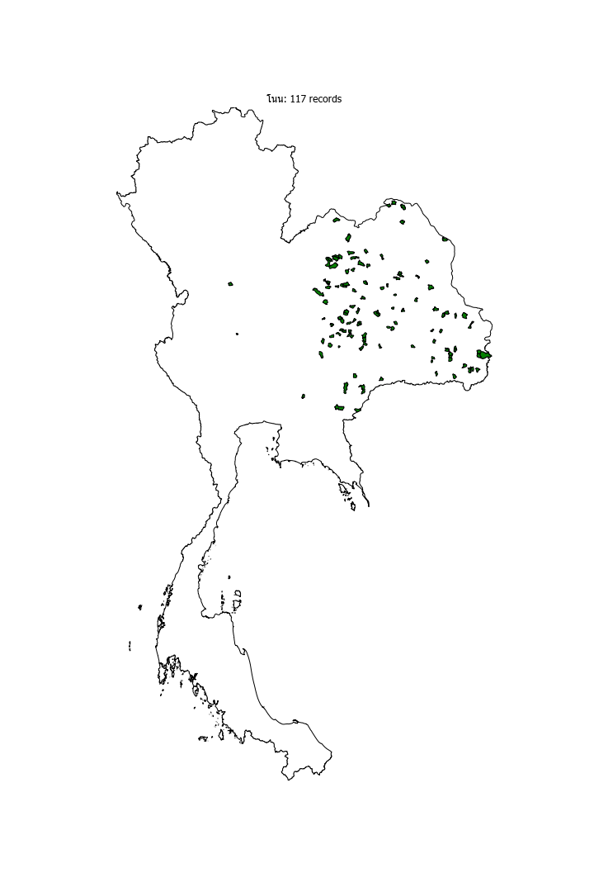
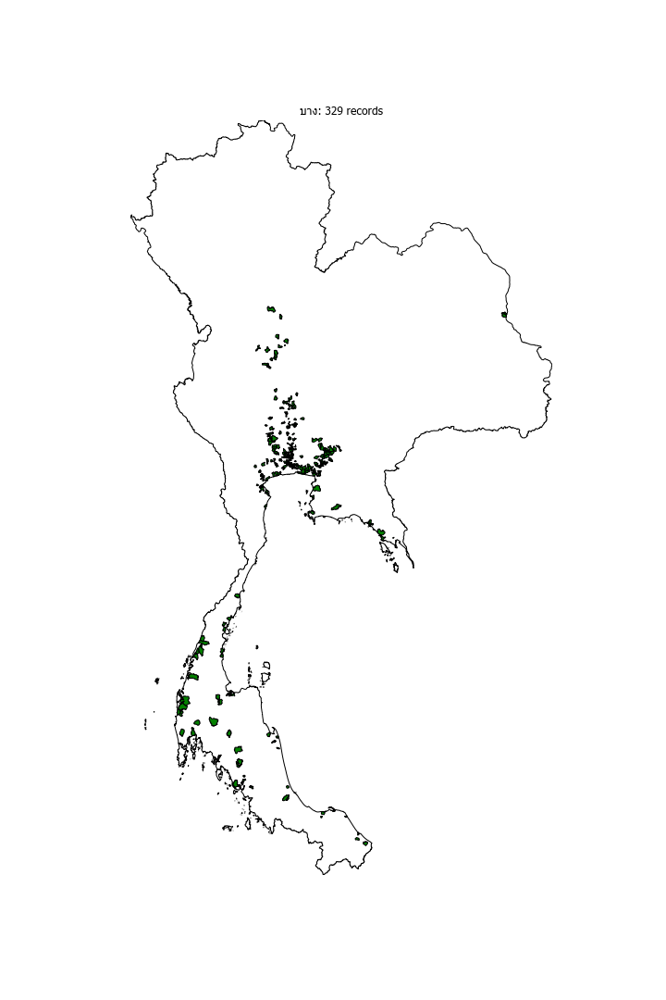

```python
import pandas as pd
import numpy as np
import geopandas as gpd
import geoplot as gplt
import matplotlib.pyplot as plt
from geoplot import polyplot
from pythainlp.tokenize import word_tokenize, syllable_tokenize
```

## Data structure

- **name**: target region name
- geometry: spatial column
- \*: parent region name, e.g. in "district" dataset it would have a "province" column

## Dissolving dataset in case you have multiple region level in the same file

```python
## assuming you have a district dataset and want to dissolve to province only
district_filename = "FILE_PATH_HERE"

gdf = gpd.read_file(district_filename)

used_columns = ['province',
                'district',]

gdf = gdf.rename(columns={'prov_namt'.upper(): 'province', # change to dummy
                         'amp_namt'.upper():'district', })

gdf = gdf[used_columns+['geometry']]

## desired data 🛎🛎🛎 please do create a datasest with outermost region, so we can use it as boundary for visualization
province = gdf.dissolve(by='province')
province = province.reset_index()\
                .rename(columns={'province': 'name'})\
                .drop(columns='district')
province
```

<div>
<style scoped>
    .dataframe tbody tr th:only-of-type {
        vertical-align: middle;
    }

    .dataframe tbody tr th {
        vertical-align: top;
    }

    .dataframe thead th {
        text-align: right;
    }

</style>
<table border="1" class="dataframe">
  <thead>
    <tr style="text-align: right;">
      <th></th>
      <th>name</th>
      <th>geometry</th>
    </tr>
  </thead>
  <tbody>
    <tr>
      <th>0</th>
      <td>กระบี่</td>
      <td>MULTIPOLYGON (((99.14285 7.57282, 99.14256 7.5...</td>
    </tr>
    <tr>
      <th>1</th>
      <td>กรุงเทพมหานคร</td>
      <td>POLYGON ((100.51756 13.66185, 100.51754 13.661...</td>
    </tr>
    <tr>
      <th>2</th>
      <td>กาญจนบุรี</td>
      <td>POLYGON ((99.76845 14.09449, 99.76898 14.09458...</td>
    </tr>
    <tr>
      <th>3</th>
      <td>กาฬสินธุ์</td>
      <td>POLYGON ((103.54900 16.21370, 103.54763 16.213...</td>
    </tr>
    <tr>
      <th>4</th>
      <td>กำแพงเพชร</td>
      <td>POLYGON ((99.97734 16.11070, 99.97546 16.10861...</td>
    </tr>
    <tr>
      <th>...</th>
      <td>...</td>
      <td>...</td>
    </tr>
    <tr>
      <th>71</th>
      <td>เพชรบุรี</td>
      <td>POLYGON ((100.02689 12.91666, 100.02690 12.916...</td>
    </tr>
    <tr>
      <th>72</th>
      <td>เพชรบูรณ์</td>
      <td>POLYGON ((101.30859 15.57351, 101.30821 15.566...</td>
    </tr>
    <tr>
      <th>73</th>
      <td>เลย</td>
      <td>POLYGON ((102.01428 17.14017, 102.01439 17.140...</td>
    </tr>
    <tr>
      <th>74</th>
      <td>แพร่</td>
      <td>POLYGON ((99.64157 18.05575, 99.64237 18.05561...</td>
    </tr>
    <tr>
      <th>75</th>
      <td>แม่ฮ่องสอน</td>
      <td>POLYGON ((98.16045 18.15059, 98.16069 18.15037...</td>
    </tr>
  </tbody>
</table>
<p>76 rows × 2 columns</p>
</div>

```python
## declare dummy variable so it can be reused with other region type
df = province
```

## EDA: tokenize region name. Use other tokenizer for your target language

```python
def tokenize(unique_region_values):
    """
    input: unique values of region type
    return: dataframe with token columns
    """

    temp = pd.DataFrame()
    temp['name'] = pd.Series(unique_region_values)
    temp['token'] = temp['name'].apply(lambda x: syllable_tokenize(x))

    # Thai doesn't use space to separate words, so it's a bit wonky
    # when I tell it to do such, that's why I need to see the results
    # manually, and in some cases it may "clip" a token
    temp['token_1-1'] = temp.token.str[0]
    temp['token_1-2'] = temp.token.str[1]
    temp['token_1_full'] = temp['token_1-1'] + temp['token_1-2']

    temp['token_2-1'] = temp.token.str[-2]
    temp['token_2-2'] = temp.token.str[-1]
    temp['token_2_full'] = temp['token_2-1'] + temp['token_2-2']

    return temp
```

Don't forget to look through the results and pick tokens you think are "correct"

```python
tokenize(df.name.unique())
```

<div>
<style scoped>
    .dataframe tbody tr th:only-of-type {
        vertical-align: middle;
    }

    .dataframe tbody tr th {
        vertical-align: top;
    }

    .dataframe thead th {
        text-align: right;
    }

</style>
<table border="1" class="dataframe">
  <thead>
    <tr style="text-align: right;">
      <th></th>
      <th>name</th>
      <th>token</th>
      <th>token_1-1</th>
      <th>token_1-2</th>
      <th>token_1_full</th>
      <th>token_2-1</th>
      <th>token_2-2</th>
      <th>token_2_full</th>
    </tr>
  </thead>
  <tbody>
    <tr>
      <th>0</th>
      <td>กระบี่</td>
      <td>[กระ, บี่]</td>
      <td>กระ</td>
      <td>บี่</td>
      <td>กระบี่</td>
      <td>กระ</td>
      <td>บี่</td>
      <td>กระบี่</td>
    </tr>
    <tr>
      <th>1</th>
      <td>กรุงเทพมหานคร</td>
      <td>[กรุง, เทพ, มหา, นคร]</td>
      <td>กรุง</td>
      <td>เทพ</td>
      <td>กรุงเทพ</td>
      <td>มหา</td>
      <td>นคร</td>
      <td>มหานคร</td>
    </tr>
    <tr>
      <th>2</th>
      <td>กาญจนบุรี</td>
      <td>[กาญ, จน, บุ, รี]</td>
      <td>กาญ</td>
      <td>จน</td>
      <td>กาญจน</td>
      <td>บุ</td>
      <td>รี</td>
      <td>บุรี</td>
    </tr>
    <tr>
      <th>3</th>
      <td>กาฬสินธุ์</td>
      <td>[กาฬ, สินธุ์]</td>
      <td>กาฬ</td>
      <td>สินธุ์</td>
      <td>กาฬสินธุ์</td>
      <td>กาฬ</td>
      <td>สินธุ์</td>
      <td>กาฬสินธุ์</td>
    </tr>
    <tr>
      <th>4</th>
      <td>กำแพงเพชร</td>
      <td>[กำ, แพง, เพชร]</td>
      <td>กำ</td>
      <td>แพง</td>
      <td>กำแพง</td>
      <td>แพง</td>
      <td>เพชร</td>
      <td>แพงเพชร</td>
    </tr>
    <tr>
      <th>...</th>
      <td>...</td>
      <td>...</td>
      <td>...</td>
      <td>...</td>
      <td>...</td>
      <td>...</td>
      <td>...</td>
      <td>...</td>
    </tr>
    <tr>
      <th>71</th>
      <td>เพชรบุรี</td>
      <td>[เพชร, บุ, รี]</td>
      <td>เพชร</td>
      <td>บุ</td>
      <td>เพชรบุ</td>
      <td>บุ</td>
      <td>รี</td>
      <td>บุรี</td>
    </tr>
    <tr>
      <th>72</th>
      <td>เพชรบูรณ์</td>
      <td>[เพชร, บูรณ์]</td>
      <td>เพชร</td>
      <td>บูรณ์</td>
      <td>เพชรบูรณ์</td>
      <td>เพชร</td>
      <td>บูรณ์</td>
      <td>เพชรบูรณ์</td>
    </tr>
    <tr>
      <th>73</th>
      <td>เลย</td>
      <td>[เลย]</td>
      <td>เลย</td>
      <td>NaN</td>
      <td>NaN</td>
      <td>NaN</td>
      <td>เลย</td>
      <td>NaN</td>
    </tr>
    <tr>
      <th>74</th>
      <td>แพร่</td>
      <td>[แพร่]</td>
      <td>แพร่</td>
      <td>NaN</td>
      <td>NaN</td>
      <td>NaN</td>
      <td>แพร่</td>
      <td>NaN</td>
    </tr>
    <tr>
      <th>75</th>
      <td>แม่ฮ่องสอน</td>
      <td>[แม่, ฮ่อง, สอน]</td>
      <td>แม่</td>
      <td>ฮ่อง</td>
      <td>แม่ฮ่อง</td>
      <td>ฮ่อง</td>
      <td>สอน</td>
      <td>ฮ่องสอน</td>
    </tr>
  </tbody>
</table>
<p>76 rows × 8 columns</p>
</div>

## Tokenize with selected slugs

```python
## replace with your slugs here
slugs = ['นคร', 'สุ', 'สมุทร', 'ธานี', 'นคร']
slugs = sorted(list(set(slugs)))
slugs = slugs[::-1] # for longest matching

## get prefix and suffix
def get_slug_1(x):
    for i in slugs:
        if (x.startswith(i)):
            return i

def get_slug_2(x):
    for i in slugs:
        if (x.endswith(i)):
            return i
```

```python
df['prefix'] = df['name'].apply(lambda x: get_slug_1(x))
df['suffix'] = df['name'].apply(lambda x: get_slug_2(x))

df
```

<div>
<style scoped>
    .dataframe tbody tr th:only-of-type {
        vertical-align: middle;
    }

    .dataframe tbody tr th {
        vertical-align: top;
    }

    .dataframe thead th {
        text-align: right;
    }

</style>
<table border="1" class="dataframe">
  <thead>
    <tr style="text-align: right;">
      <th></th>
      <th>name</th>
      <th>geometry</th>
      <th>prefix</th>
      <th>suffix</th>
      <th>class</th>
    </tr>
  </thead>
  <tbody>
    <tr>
      <th>0</th>
      <td>กระบี่</td>
      <td>MULTIPOLYGON (((99.14285 7.57282, 99.14256 7.5...</td>
      <td>None</td>
      <td>None</td>
      <td>class</td>
    </tr>
    <tr>
      <th>1</th>
      <td>กรุงเทพมหานคร</td>
      <td>POLYGON ((100.51756 13.66185, 100.51754 13.661...</td>
      <td>None</td>
      <td>นคร</td>
      <td>class</td>
    </tr>
    <tr>
      <th>2</th>
      <td>กาญจนบุรี</td>
      <td>POLYGON ((99.76845 14.09449, 99.76898 14.09458...</td>
      <td>None</td>
      <td>None</td>
      <td>class</td>
    </tr>
    <tr>
      <th>3</th>
      <td>กาฬสินธุ์</td>
      <td>POLYGON ((103.54900 16.21370, 103.54763 16.213...</td>
      <td>None</td>
      <td>None</td>
      <td>class</td>
    </tr>
    <tr>
      <th>4</th>
      <td>กำแพงเพชร</td>
      <td>POLYGON ((99.97734 16.11070, 99.97546 16.10861...</td>
      <td>None</td>
      <td>None</td>
      <td>class</td>
    </tr>
    <tr>
      <th>...</th>
      <td>...</td>
      <td>...</td>
      <td>...</td>
      <td>...</td>
      <td>...</td>
    </tr>
    <tr>
      <th>71</th>
      <td>เพชรบุรี</td>
      <td>POLYGON ((100.02689 12.91666, 100.02690 12.916...</td>
      <td>None</td>
      <td>None</td>
      <td>class</td>
    </tr>
    <tr>
      <th>72</th>
      <td>เพชรบูรณ์</td>
      <td>POLYGON ((101.30859 15.57351, 101.30821 15.566...</td>
      <td>None</td>
      <td>None</td>
      <td>class</td>
    </tr>
    <tr>
      <th>73</th>
      <td>เลย</td>
      <td>POLYGON ((102.01428 17.14017, 102.01439 17.140...</td>
      <td>None</td>
      <td>None</td>
      <td>class</td>
    </tr>
    <tr>
      <th>74</th>
      <td>แพร่</td>
      <td>POLYGON ((99.64157 18.05575, 99.64237 18.05561...</td>
      <td>None</td>
      <td>None</td>
      <td>class</td>
    </tr>
    <tr>
      <th>75</th>
      <td>แม่ฮ่องสอน</td>
      <td>POLYGON ((98.16045 18.15059, 98.16069 18.15037...</td>
      <td>None</td>
      <td>None</td>
      <td>class</td>
    </tr>
  </tbody>
</table>
<p>76 rows × 5 columns</p>
</div>

## Viz prep

```python
## make total_bound (background outline)
## and extend (so the canvas would center at the same point)
## also, remember the PROVINCE dataset from the start? we're going to use that

province['class'] = 'class' # a dummy column so it would dissolve the whole dataset
boundary = province.dissolve(by='class')
extent = boundary.total_bounds
```

```python
## set font (default matplotlib font can't render Thai)
plt.rcParams["font.family"] = "Tahoma"
```

## Cleaning it up

There are some degree of Pali-Sanskrit influence in Thai, in which the word order is different, so it is possible for a certain \*fix to appear as either prefix or suffix. it's like **re**peat and do**re** (for redo)

```python
## ⛩⛩⛩ rerun from this cell onward if you want to change *fix ⛩⛩⛩
## filter null *fix
_fix_column = 'suffix' # ⛩⛩⛩ change here ⛩⛩⛩
df_temp = df
df_temp = df_temp[df_temp[_fix_column].notnull()]

## get count
df_temp['{}_count'.format(_fix_column)] = df_temp[_fix_column].map(df_temp[_fix_column]\
                                            .value_counts()\
                                            .to_dict())
```

```python
## at the largest region level it won't be much, but at a smaller level like subdistrict
## having a single *fix for the entire dataset can happen, hence we should filter it out

## filter for a *fix you want to visualize
viz_categ_count_column = '{}_count'.format(_fix_column)

## ⛩⛩⛩ use the second line if you want to set the threshold with median ⛩⛩⛩
threshold = 0
## threshold = df_temp[viz_categ_count_column].median()

df_temp = df_temp[df_temp[viz_categ_count_column] >= threshold]
```

```python
df_temp
```

<div>
<style scoped>
    .dataframe tbody tr th:only-of-type {
        vertical-align: middle;
    }

    .dataframe tbody tr th {
        vertical-align: top;
    }

    .dataframe thead th {
        text-align: right;
    }

</style>
<table border="1" class="dataframe">
  <thead>
    <tr style="text-align: right;">
      <th></th>
      <th>name</th>
      <th>geometry</th>
      <th>prefix</th>
      <th>suffix</th>
      <th>class</th>
      <th>suffix_count</th>
    </tr>
  </thead>
  <tbody>
    <tr>
      <th>1</th>
      <td>กรุงเทพมหานคร</td>
      <td>POLYGON ((100.51756 13.66185, 100.51754 13.661...</td>
      <td>None</td>
      <td>นคร</td>
      <td>class</td>
      <td>2</td>
    </tr>
    <tr>
      <th>25</th>
      <td>ปทุมธานี</td>
      <td>POLYGON ((100.91417 13.95445, 100.91415 13.952...</td>
      <td>None</td>
      <td>ธานี</td>
      <td>class</td>
      <td>5</td>
    </tr>
    <tr>
      <th>48</th>
      <td>สกลนคร</td>
      <td>POLYGON ((104.36246 17.09941, 104.36248 17.099...</td>
      <td>None</td>
      <td>นคร</td>
      <td>class</td>
      <td>2</td>
    </tr>
    <tr>
      <th>58</th>
      <td>สุราษฎร์ธานี</td>
      <td>MULTIPOLYGON (((99.20865 8.33715, 99.20647 8.3...</td>
      <td>สุ</td>
      <td>ธานี</td>
      <td>class</td>
      <td>5</td>
    </tr>
    <tr>
      <th>64</th>
      <td>อุดรธานี</td>
      <td>POLYGON ((103.44196 17.21428, 103.44246 17.214...</td>
      <td>None</td>
      <td>ธานี</td>
      <td>class</td>
      <td>5</td>
    </tr>
    <tr>
      <th>66</th>
      <td>อุทัยธานี</td>
      <td>POLYGON ((100.04080 15.29612, 100.04067 15.296...</td>
      <td>None</td>
      <td>ธานี</td>
      <td>class</td>
      <td>5</td>
    </tr>
    <tr>
      <th>67</th>
      <td>อุบลราชธานี</td>
      <td>POLYGON ((105.55486 14.95406, 105.55414 14.953...</td>
      <td>None</td>
      <td>ธานี</td>
      <td>class</td>
      <td>5</td>
    </tr>
  </tbody>
</table>
</div>

## Viz

```python
import os

key_column = _fix_column
key_name = 'province' # ⛩⛩⛩ set region type here #
key_count_column = '{}_count'.format(key_column)

out_dir = 'plot/{}_{}'.format(key_name, key_column)
os.makedirs(out_dir, exist_ok=True)

gdf = df_temp
for key in gdf[key_column].unique():
    ax = gplt.polyplot(boundary, figsize=(10, 15))

    query = gdf[gdf[key_column]==key]
    total_records = str(int(query[key_count_column].tolist()[0]))

    gplt.polyplot(query, ax=ax, extent=extent,edgecolor='black',
                        facecolor='green')

    plt.title('{}: {} records'.format(key, total_records))

    plt.savefig('{}/{}_{}.png'.format(out_dir, str(total_records).zfill(3), key))
##     break
```

## Output structure



## Some interesting outputs (at subdistrict level)

### Northern region

You can see that the prefix "แม่" concentrates around the northern region.


### Eastern region

"โนน" seems to be specific to the eastern seeing it's clustered around the eastern part of the country.


### Multi-region

As expected, "บาง" is clustered around the central region, no surprise here since the old name of Thailand's capital (it's located in the central region) is "บางกอก." But you can see that it's clustered around the southern parts as well.


